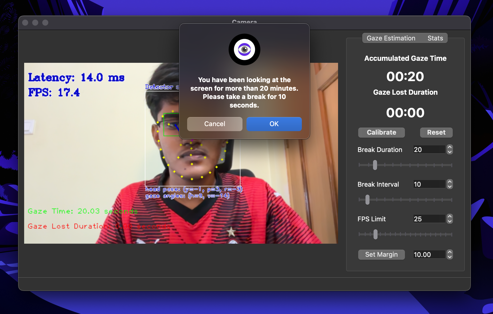

  

<h1 align="center">VisionGuard</h1>

  <strong>Protect Your Eyes, Enhance Your Productivity</strong>

  <a href="#features">Features</a> •
  <a href="#installation">Installation</a> •
  <a href="#usage">Usage</a> •
  <a href="#development">Development</a> •
  <a href="docs/ARCHITECTURE.md">Architecture</a> •
  <a href="docs/BENCHMARKING.md">Benchmarks</a> •
  <a href="#contributing">Contributing</a> •
  <a href="#license">License</a> •
  <a href="https://medium.com/openvino-toolkit/visionguard-ai-eye-care-for-computer-users-d055a574d8e9">Blog</a>

  
  

## About VisionGuard

VisionGuard is an innovative desktop application designed to combat eye strain resulting from prolonged screen time. Leveraging advanced computer vision technology, it utilizes your PC's webcam to monitor screen time and provide timely break reminders, promoting healthier computing habits and reducing eye fatigue.

  

### Key Advantages

- **Privacy-Focused:** Operates entirely locally, requiring no internet access.
- **Data Security:** All data remains on your device, ensuring your privacy.
- **Performance Optimized:** Supports inference on AI PC's Neural Processing Unit (NPU) for enhanced efficiency.

This project was developed as part of [Google Summer of Code 2024](https://summerofcode.withgoogle.com/programs/2024) under the [OpenVINO Toolkit](https://github.com/openvinotoolkit), mentored by [Dmitriy Pastushenkov](https://github.com/DimaPastushenkov), [Ria Cheruvu](https://github.com/riacheruvu), and [ZhuoWu](https://github.com/zhuo-yoyowz). For more details, visit the [GSoC Project Page](https://summerofcode.withgoogle.com/programs/2024/projects/QUbIeRAM).

## Features

### **Performance and Efficiency**

- **Real-time Gaze Tracking:** Local processing ensures accurate and private screen-time monitoring.
- **Device Switching:** Easily toggle between CPU, GPU, and NPU for optimal performance.
- **Edge Inference:** Leverage edge devices for faster and more efficient processing.
- **Performance Optimization:** Switch between quantized weights and control frame processing limits.
- **Resource Monitoring:** Track system resources for efficient performance.
- **Built with C++:** Developed using C++, a low-level language close to the system, ensuring high performance with memory efficiency.
- **Powered by Libraries:** Built using Qt6 for the UI, OpenCV for computer vision, and OpenVINO for model inference, for an efficient performance.

### **Privacy and Data Security**

- **Data Kept Locally:** All data is processed and stored locally, ensuring privacy.
- **Screen Time Statistics:** View daily/weekly usage stats, automatically cleared after a week for privacy.

### **Customization and Accessibility**

- **Custom Break Notifications:** Alerts based on customizable intervals, including the 20-20-20 rule.
- **Dark/Light Themes:** Customize the interface with light or dark themes.
- **Multiple Cameras:** Support for up to five camera devices.
- **System Tray Access:** VisionGuard runs in the tray for easy access.

### **Installation and Extensibility**

- **Easy Windows Setup:** Comes with an easy installation setup for Windows.
- **Cross-Platform Libraries:** Utilizes cross-platform libraries like Qt6, OpenCV, and OpenVINO, dynamically linked for extensibility and future updates.

## Installation

Get started with VisionGuard by following our step-by-step [Installation Guide](docs/INSTALLATION.md).

## Usage

Learn how to make the most of VisionGuard's features with our comprehensive [User Guide](docs/USAGE.md).

## Development

Interested in contributing or building VisionGuard from source? Our [Development Guide](docs/DEVELOPMENT.md) provides all the information you need to get started.

### Architecture

For a deep dive into VisionGuard's technical architecture, including backend processes and gaze estimation models, consult our [Architecture Documentation](docs/ARCHITECTURE.md).

### Benchmarking

We've conducted extensive performance benchmarks across various devices. View our findings in the [Benchmarking Documentation](docs/BENCHMARKING.md).

## Contributing

We welcome contributions from the community! Before submitting your pull request, please review our [Contributing Guidelines](docs/CONTRIBUTING.md).

## Reporting Issues

Encountered a bug or have a suggestion? We value your feedback! Please open an [issue](https://github.com/inbasperu/VisionGuard/issues) in our GitHub repository.

## License

VisionGuard is dual-licensed:

- Core application code (non-Qt): Apache License 2.0
- Qt-dependent components: GNU Lesser General Public License (LGPL) version 3

For full details, refer to our [License File](LICENSE.md).

## Acknowledgements

- **Lead Developer:** [Inbasekaran](https://github.com/inbasperu)
- **Mentors:** Dmitriy Pastushenkov, Ria Cheruvu, ZhuoWu
- **OpenVINO Toolkit Community**

## Blog

Stay updated with our latest developments and insights on our [Blog](docs/BLOG_DRAFT.md).

---

  Made with ❤️ for healthier computing habits

