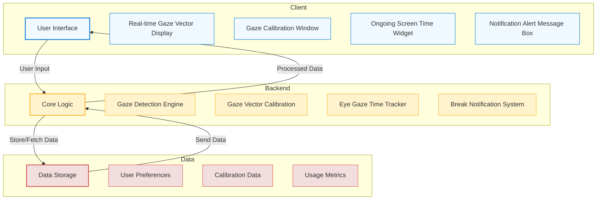
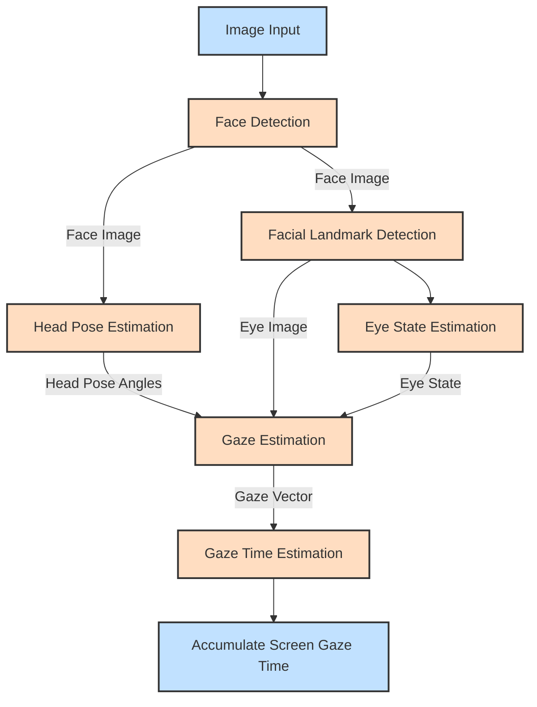

# VisionGuard

VisionGuard is a desktop application designed to help prevent eye strain from excessive screen time. Using your PC's webcam, it monitors how long you look at the screen and reminds you to take breaks. This helps reduce eye fatigue and promotes healthier computer usage habits. The app is user-friendly, allowing customization of break times and providing reports on screen time. VisionGuard operates efficiently by leveraging the AI PC's Neural Processing Unit (NPU), eliminating the need for an internet connection and minimizing power usage. This ensures privacy and practicality for daily use, without slowing down your computer. All data remains on your PC, safeguarding your privacy.

## VisionGuard Deliverables

### Back Development

- [x] Implement Gaze Detection Model
- [x] Estimate Eye Gaze Time
- [x] Alert User for Breaks through Notifications (20-20-20)
- [x] Integrate the GUI
- [x] Utilize NPU and GPU
- [x] Customizable Settings (Interval and Duration)
- [x] Screen Time Reports
  - [x] Daily
  - [x] Weekly
- [x] Perform Reports
  - [x] Latency
  - [x] FPS
  - [x] Resource Utilization Graphs
- [ ] Calibrate the Gaze Vector Range
- [ ] Perform Optimizations
- [ ] Handle Multi-Monitor Setup
- [ ] Handle Multi-Users

### GUI Development

- [x] Real-time User Gaze Vector Display
- [x] Ongoing Screen Time Widget
- [x] Notification Alert Message Box
- [x] Customizable Settings (Interval and Duration)
- [x] Screen Time Reports
  - [x] Daily
  - [x] Weekly
- [x] Perform Reports
  - [x] Latency
  - [x] FPS
  - [x] Resource Utilization Graphs
- [ ] Display device (CPU, NPU, GPU)
- [ ] Display model (INT8, FP16, FP32)
- [ ] Add AUTO to the list of devices and test the application with AUTO.
- [ ] Run inference at user-specified FPS
- [ ] Gaze Calibration Window
- [ ] Windows system tray application
- [ ] Adaptive UI
- [ ] Dark and Light Theme Support
- [ ] VisionGuard Logo
- [ ] Handle Multi-Monitor Setup
- [ ] Handle Multi-Users

### Benchmarking

- [ ] CPU vs. GPU vs. NPU
  - [ ] Power Consumption
  - [ ] Resource Utilization
  - [ ] Performance Metrics

### Documentation

- [ ] Setup and Development Process
- [ ] Gaze Detection and Calibration Steps
- [ ] New Features and Optimizations
- [ ] User Guides for Initial and Advanced Features
- [ ] Benchmarking Results

### User Testing

- [x] Initial User Testing and Feedback Collection
- [ ] Iterative Improvements Based on User Feedback
- [ ] Final User Testing and Validation

### Bugs

- [ ] Investigate why NPU is always active regardless of the selected device.
- [ ] Resolve discrepancies in CPU resource utilization between the application and Task Manager.
- [ ] Fix the GUI issue to ensure numbers are visible and indicate units (minutes and seconds).
- [ ] Provide feedback when "calibrate" is clicked.

### Research

- [ ] Propose an approach to test the accuracy of the solution.
- [ ] Research how accuracy depends on FPS and estimate the optimal FPS value for minimal power consumption.
- [ ] Review the provided procedure to measure power consumption.

### Deployment Deliverables

- [ ] Create an executable and deploy on Windows.
- [ ] Create an executable and deploy on Linux (Ubuntu, Fedora, Arch).
- [ ] Create an executable and deploy on MacOS.
- [ ] Set up GitHub workflows for CI/CD.

### Suggested GitHub Workflows

1. **Continuous Integration (CI) Workflow:**
   - **Build:** Ensure the application builds correctly on different operating systems (Windows, Linux, MacOS).
   - **Test:** Run unit tests and integration tests to validate the application.
   - **Lint:** Check the code for styling and potential errors using tools like `clang-tidy` for C++ and `flake8` for Python scripts (if any).

2. **Continuous Deployment (CD) Workflow:**
   - **Release:** Automatically create releases and deploy executables to GitHub Releases when new tags are pushed.
   - **Packaging:** Package the application for different platforms and ensure the executables are uploaded to the release.

3. **Code Quality Workflow:**
   - **Static Analysis:** Run static analysis tools to check for code quality and potential bugs.

4. **Documentation Workflow:**
   - **Generate Documentation:** Automatically generate and deploy documentation.

## Project Status

This project is under development as part of GSoC 2024 under OpenVINO. For more details, visit the [GSoC Project Page](https://summerofcode.withgoogle.com/programs/2024/projects/QUbIeRAM).

## Links

- [Gaze Estimation Demo](https://docs.openvino.ai/2024/omz_demos_gaze_estimation_demo_cpp.html)
- [VisionGuard Project Gantt Chart](https://docs.google.com/spreadsheets/d/1CfnZK7eUM7_uEG4tkpvwrrlmc7pPPsqp847bD5i0BZQ/edit?usp=sharing)

## Contributors

- **Contributor:** [Inbasekaran](https://github.com/inbasperu)
- **Mentors:** [ZhuoWu](https://github.com/zhuo-yoyowz), [Dmitriy Pastushenkov](https://github.com/DimaPastushenkov), [Ria Cheruvu](https://github.com/riacheruvu)
- **Organization:** [OpenVINO Toolkit](https://github.com/openvinotoolkit)

## License

This project is licensed under the Apache 2.0 License - see the LICENSE file for details.

---

## VisionGuard Architecture

### High-Level Architecture



### Description of Modules

- **Client (UI)**
  - **User Interface (UI):** The main interface through which users interact with the application.
  - **Real-time Gaze Vector Display (GVD):** Displays the user's real-time gaze vector.
  - **Gaze Calibration Window (GCW):** Window for calibrating the gaze detection system.
  - **Ongoing Screen Time Widget (STW):** Widget showing the ongoing screen time.
  - **Notification Alert Message Box (NAM):** Box for displaying notifications and alerts.

- **Backend**
  - **Core Logic (CL):** Central module that processes user input and manages the flow of data.
  - **Gaze Detection Engine (GDM):** Engine responsible for detecting and processing gaze vectors.
  - **Gaze Vector Calibration (GVC):** Handles the calibration of gaze vectors.
  - **Eye Gaze Time Tracker (EGT):** Tracks the amount of time the user's gaze is on the screen.
  - **Break Notification System (BNS):** Manages notifications to prompt the user to take breaks.

- **Data**
  - **Data Storage (DS):** Central repository for storing all data.
  - **User Preferences (UP):** Stores user-specific preferences and settings.
  - **Calibration Data (CD):** Holds data related to the calibration of the gaze detection system.
  - **Usage Metrics (UM):** Keeps track of usage statistics and metrics.

### VisionGuard Backend

The VisionGuard Backend leverages the OpenVINO model zoo to estimate a user's gaze and calculate the accumulated screen gaze time. The following networks are integral to the backend:

#### Face Detection Model

This model identifies the locations of faces within an image. You can choose from the following networks:

- [`face-detection-retail-0005`](https://docs.openvino.ai/2024/omz_models_model_face_detection_retail_0005.html)
- [`face-detection-retail-0004`](https://docs.openvino.ai/2024/omz_models_model_face_detection_retail_0004.html)
- [`face-detection-adas-0001`](https://docs.openvino.ai/2024/omz_models_model_face_detection_adas_0001.html)

#### Head Pose Estimation Model

This model estimates the head pose in [Tait-Bryan angles](https://en.wikipedia.org/wiki/Euler_angles#Tait–Bryan_angles). It outputs yaw, pitch, and roll angles in degrees, which serve as inputs for the gaze estimation model. The following network can be used:

- [`head-pose-estimation-adas-0001`](https://docs.openvino.ai/2024/omz_models_model_head_pose_estimation_adas_0001.html)

#### Facial Landmark Detection Model

This model estimates the coordinates of facial landmarks for detected faces. Keypoints at the corners of the eyes are used to locate the eye regions required for the gaze estimation model. You can choose from:

- [`facial-landmarks-35-adas-0002`](https://docs.openvino.ai/2024/omz_models_model_facial_landmarks_35_adas_0002.html)
- [`facial-landmarks-98-detection-0001`](https://docs.openvino.ai/2022.3/omz_models_model_facial_landmarks_98_detection_0001.html)

#### Eye State Estimation Model

This model determines the open or closed state of the eyes in detected faces. The following model can be used:

- [`open-closed-eye-0001`](https://docs.openvino.ai/2022.3/omz_models_model_open_closed_eye_0001.html)

#### Gaze Estimation Model

This model takes three inputs: square crops of the left and right eye images, and three head pose angles (yaw, pitch, and roll). It outputs a 3-D vector representing the direction of a person’s gaze in a Cartesian coordinate system. The following network is used:

- [`gaze-estimation-adas-0002`](https://docs.openvino.ai/2024/omz_models_model_gaze_estimation_adas_0002.html)

#### Pipeline Diagram



### Demo

#### GUI Application

Follow the installation instructions in the release note of [VisionGuard](https://github.com/inbasperu/VisionGuard/releases/tag/v1.0.0)

#### CLI Application

Running the application with the `-h` option yields the following usage message:

```bash
gaze_estimation_demo [OPTION]
Options:
    -h                       Print a usage message.
    -i                       Required. An input to process. The input must be a single image, a folder of images, video file or camera id.
    -loop                    Optional. Enable reading the input in a loop.
    -o "<path>"              Optional. Name of the output file(s) to save. Frames of odd width or height can be truncated. See https://github.com/opencv/opencv/pull/24086
    -limit "<num>"           Optional. Number of frames to store in output. If 0 is set, all frames are stored.
    -res "<WxH>"             Optional. Set camera resolution in format WxH.
    -m "<path>"              Required. Path to an .xml file with a trained Gaze Estimation model.
    -m_fd "<path>"           Required. Path to an .xml file with a trained Face Detection model.
    -m_hp "<path>"           Required. Path to an .xml file with a trained Head Pose Estimation model.
    -m_lm "<path>"           Required. Path to an .xml file with a trained Facial Landmarks Estimation model.
    -m_es "<path>"           Required. Path to an .xml file with a trained Open/Closed Eye Estimation model.
    -d "<device>"            Optional. Target device for Gaze Estimation network (the list of available devices is shown below). Use "-d HETERO:<comma-separated_devices_list>" format to specify HETERO plugin. The demo will look for a suitable plugin for a specified device. Default value is "CPU".
    -d_fd "<device>"         Optional. Target device for Face Detection network (the list of available devices is shown below). Use "-d HETERO:<comma-separated_devices_list>" format to specify HETERO plugin. The demo will look for a suitable plugin for a specified device. Default value is "CPU".
    -d_hp "<device>"         Optional. Target device for Head Pose Estimation network (the list of available devices is shown below). Use "-d HETERO:<comma-separated_devices_list>" format to specify HETERO plugin. The demo will look for a suitable plugin for a specified device. Default value is "CPU".
    -d_lm "<device>"         Optional. Target device for Facial Landmarks Estimation network (the list of available devices is shown below). Use "-d HETERO:<comma-separated_devices_list>" format to specify HETERO plugin. The demo will look for a suitable plugin for a specified device. Default value is "CPU".
    -d_es "<device>"         Optional. Target device for Open/Closed Eye network (the list of available devices is shown below). Use "-d HETERO:<comma-separated_devices_list>" format to specify HETERO plugin. The demo will look for a suitable plugin for a specified device. Default value is "CPU".
    -fd_reshape              Optional. Reshape Face Detector network so that its input resolution has the same aspect ratio as the input frame.
    -no_show                 Optional. Don't show output.
    -r                       Optional. Output inference results as raw values.
    -t                       Optional. Probability threshold for Face Detector. The default value is 0.5.
    -u                       Optional. List of monitors to show initially.
```

Running the application with an empty list of options yields an error message.

For example, to do inference on a CPU, run the following command:

```sh
./gaze_estimation_demo \
  -d CPU \
  -i <path_to_video>/input_video.mp4 \
  -m <path_to_model>/gaze-estimation-adas-0002.xml \
  -m_fd <path_to_model>/face-detection-retail-0004.xml \
  -m_hp <path_to_model>/head-pose-estimation-adas-0001.xml \
  -m_lm <path_to_model>/facial-landmarks-35-adas-0002.xml \
  -m_es <path_to_model>/open-closed-eye-0001.xml
```

#### Run-Time Control Keys

The demo allows you to control what information is displayed in run-time. The following keys are supported:

- G - to toggle displaying gaze vector
- B - to toggle displaying face detector bounding boxes
- O - to toggle displaying head pose information
- L - to toggle displaying facial landmarks
- E - to toggle displaying eyes state
- A - to switch on displaying all inference results
- N - to switch off displaying all inference results
- F - to flip frames horizontally
- Esc - to quit the demo

## Directory Structure

```bash
.
├── CMakeLists.txt
├── README.md
├── models
│   ├── intel
│   │   ├── face-detection-adas-0001
│   │   ├── face-detection-retail-0004
│   │   ├── face-detection-retail-0005
│   │   ├── facial-landmarks-35-adas-0002
│   │   ├── facial-landmarks-98-detection-0001
│   │   ├── gaze-estimation-adas-0002
│   │   └── head-pose-estimation-adas-0001
│   └── public
│       └── open-closed-eye-0001
└── src
    ├── app
    │   ├── main.cpp
    │   ├── mainwindow.cpp
    │   ├── mainwindow.h
    │   └── mainwindow.ui
    └── gaze_estimation_backend
        ├── gaze_estimation
        │   └── cpp
        │       ├── CMakeLists.txt
        │       ├── README.md
        │       ├── gaze_estimation_demo.hpp
        │       ├── include
        │       │   ├── base_estimator.hpp
        │       │   ├── eye_state_estimator.hpp
        │       │   ├── face_detector.hpp
        │       │   ├── face_inference_results.hpp
        │       │   ├── gaze_estimator.hpp
        │       │   ├── head_pose_estimator.hpp
        │       │   ├── ie_wrapper.hpp
        │       │   ├── landmarks_estimator.hpp
        │       │   ├── results_marker.hpp
        │       │   ├── utils.hpp
        │       │   └── vision_guard.hpp
        │       ├── main.cpp
        │       ├── models.lst
        │       └── src
        │           ├── eye_state_estimator.cpp
        │           ├── face_detector.cpp
        │           ├── face_inference_results.cpp
        │           ├── gaze_estimator.cpp
        │           ├── head_pose_estimator.cpp
        │           ├── ie_wrapper.cpp
        │           ├── landmarks_estimator.cpp
        │           ├── results_marker.cpp
        │           ├── utils.cpp
        │           └── vision_guard.cpp
        ├── multi_channel_common
        └── thirdparty
            └── gflags
```

### Setup and Build

1. **Set Environment Variables:**
    ```bash
    export OpenVINO_DIR=/Users/inbasekaranperumal/Developer/Programs/OpenVINO-install-dir/runtime/cmake
    export OpenCV_DIR=/Users/inbasekaranperumal/Developer/OpenSource/build_opencv
    ```

2. **Build Project:**
    ```bash
    cmake -DCMAKE_BUILD_TYPE=Release /Users/inbasekaranperumal/Developer/OpenSource/GSoC/code/VisionGuard
    cmake --build .
    ```

3. **Run Application:**

    ```bash
    ./build/arm64/Release/gaze_estimation -d CPU -i 0  \
    -m ./models/intel/gaze-estimation-adas-0002/FP32/gaze-estimation-adas-0002.xml \
    -m_fd ./models/intel/face-detection-retail-0004/FP32/face-detection-retail-0004.xml \
    -m_hp ./models/intel/head-pose-estimation-adas-0001/FP32/head-pose-estimation-adas-0001.xml \
    -m_lm ./models/intel/facial-landmarks-35-adas-0002/FP32/facial-landmarks-35-adas-0002.xml \
    -m_es ./models/public/open-closed-eye-0001/FP32/open-closed-eye-0001.xml
    ```