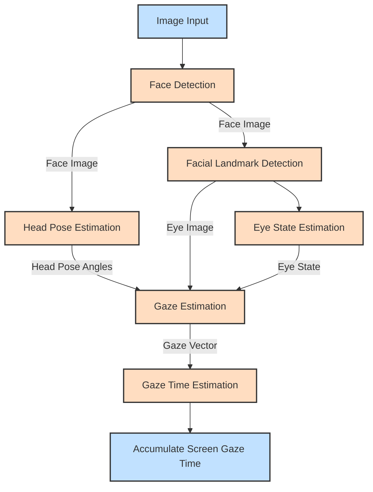

# VisionGuard

## VisionGuard Backend

The VisionGuard Backend leverages the OpenVINO model zoo to estimate a user's gaze and calculate the accumulated screen gaze time. The following networks are integral to the backend:

### Face Detection Model

This model identifies the locations of faces within an image. You can choose from the following networks:

- [`face-detection-retail-0005`](https://docs.openvino.ai/2024/omz_models_model_face_detection_retail_0005.html)
- [`face-detection-retail-0004`](https://docs.openvino.ai/2024/omz_models_model_face_detection_retail_0004.html)
- [`face-detection-adas-0001`](https://docs.openvino.ai/2024/omz_models_model_face_detection_adas_0001.html)

### Head Pose Estimation Model

This model estimates the head pose in [Tait-Bryan angles](https://en.wikipedia.org/wiki/Euler_angles#Tait–Bryan_angles). It outputs yaw, pitch, and roll angles in degrees, which serve as inputs for the gaze estimation model. The following network can be used:

- [`head-pose-estimation-adas-0001`](https://docs.openvino.ai/2024/omz_models_model_head_pose_estimation_adas_0001.html)

### Facial Landmark Detection Model

This model estimates the coordinates of facial landmarks for detected faces. Keypoints at the corners of the eyes are used to locate the eye regions required for the gaze estimation model. You can choose from:

- [`facial-landmarks-35-adas-0002`](https://docs.openvino.ai/2024/omz_models_model_facial_landmarks_35_adas_0002.html)
- [`facial-landmarks-98-detection-0001`](https://docs.openvino.ai/2022.3/omz_models_model_facial_landmarks_98_detection_0001.html)

### Eye State Estimation Model

This model determines the open or closed state of the eyes in detected faces. The following model can be used:

- [`open-closed-eye-0001`](https://docs.openvino.ai/2022.3/omz_models_model_open_closed_eye_0001.html)

### Gaze Estimation Model

This model takes three inputs: square crops of the left and right eye images, and three head pose angles (yaw, pitch, and roll). It outputs a 3-D vector representing the direction of a person’s gaze in a Cartesian coordinate system. The following network is used:

- [`gaze-estimation-adas-0002`](https://docs.openvino.ai/2024/omz_models_model_gaze_estimation_adas_0002.html)

### Pipeline Diagram



## Demo

Running the application with the `-h` option yields the following usage message:

```bash
gaze_estimation_demo [OPTION]
Options:

    -h                       Print a usage message.
    -i                       Required. An input to process. The input must be a single image, a folder of images, video file or camera id.
    -loop                    Optional. Enable reading the input in a loop.
    -o "<path>"              Optional. Name of the output file(s) to save. Frames of odd width or height can be truncated. See https://github.com/opencv/opencv/pull/24086
    -limit "<num>"           Optional. Number of frames to store in output. If 0 is set, all frames are stored.
    -res "<WxH>"             Optional. Set camera resolution in format WxH.
    -m "<path>"              Required. Path to an .xml file with a trained Gaze Estimation model.
    -m_fd "<path>"           Required. Path to an .xml file with a trained Face Detection model.
    -m_hp "<path>"           Required. Path to an .xml file with a trained Head Pose Estimation model.
    -m_lm "<path>"           Required. Path to an .xml file with a trained Facial Landmarks Estimation model.
    -m_es "<path>"           Required. Path to an .xml file with a trained Open/Closed Eye Estimation model.
    -d "<device>"            Optional. Target device for Gaze Estimation network (the list of available devices is shown below). Use "-d HETERO:<comma-separated_devices_list>" format to specify HETERO plugin. The demo will look for a suitable plugin for a specified device. Default value is "CPU".
    -d_fd "<device>"         Optional. Target device for Face Detection network (the list of available devices is shown below). Use "-d HETERO:<comma-separated_devices_list>" format to specify HETERO plugin. The demo will look for a suitable plugin for a specified device. Default value is "CPU".
    -d_hp "<device>"         Optional. Target device for Head Pose Estimation network (the list of available devices is shown below). Use "-d HETERO:<comma-separated_devices_list>" format to specify HETERO plugin. The demo will look for a suitable plugin for a specified device. Default value is "CPU".
    -d_lm "<device>"         Optional. Target device for Facial Landmarks Estimation network (the list of available devices is shown below). Use "-d HETERO:<comma-separated_devices_list>" format to specify HETERO plugin. The demo will look for a suitable plugin for a specified device. Default value is "CPU".
    -d_es "<device>"         Optional. Target device for Open/Closed Eye network (the list of available devices is shown below). Use "-d HETERO:<comma-separated_devices_list>" format to specify HETERO plugin. The demo will look for a suitable plugin for a specified device. Default value is "CPU".
    -fd_reshape              Optional. Reshape Face Detector network so that its input resolution has the same aspect ratio as the input frame.
    -no_show                 Optional. Don't show output.
    -r                       Optional. Output inference results as raw values.
    -t                       Optional. Probability threshold for Face Detector. The default value is 0.5.
    -u                       Optional. List of monitors to show initially.
```

Running the application with an empty list of options yields an error message.

For example, to do inference on a CPU, run the following command:

```sh
./gaze_estimation_demo \
  -d CPU \
  -i <path_to_video>/input_video.mp4 \
  -m <path_to_model>/gaze-estimation-adas-0002.xml \
  -m_fd <path_to_model>/face-detection-retail-0004.xml \
  -m_hp <path_to_model>/head-pose-estimation-adas-0001.xml \
  -m_lm <path_to_model>/facial-landmarks-35-adas-0002.xml \
  -m_es <path_to_model>/open-closed-eye-0001.xml
```

### Run-Time Control Keys

The demo allows you to control what information is displayed in run-time.
The following keys are supported:

- G - to toggle displaying gaze vector
- B - to toggle displaying face detector bounding boxes
- O - to toggle displaying head pose information
- L - to toggle displaying facial landmarks
- E - to toggle displaying eyes state
- A - to switch on displaying all inference results
- N - to switch off displaying all inference results
- F - to flip frames horizontally
- Esc - to quit the demo

## Directory Structure

``` bash
.
├── CMakeLists.txt
├── README.md
├── models
│   ├── intel
│   │   ├── face-detection-adas-0001
│   │   ├── face-detection-retail-0004
│   │   ├── face-detection-retail-0005
│   │   ├── facial-landmarks-35-adas-0002
│   │   ├── facial-landmarks-98-detection-0001
│   │   ├── gaze-estimation-adas-0002
│   │   └── head-pose-estimation-adas-0001
│   └── public
│       └── open-closed-eye-0001
└── src
    ├── app
    │   ├── main.cpp
    │   ├── mainwindow.cpp
    │   ├── mainwindow.h
    │   └── mainwindow.ui
    └── gaze_estimation_backend
        ├── gaze_estimation
        │   └── cpp
        │       ├── CMakeLists.txt
        │       ├── README.md
        │       ├── gaze_estimation_demo.hpp
        │       ├── include
        │       │   ├── base_estimator.hpp
        │       │   ├── eye_state_estimator.hpp
        │       │   ├── face_detector.hpp
        │       │   ├── face_inference_results.hpp
        │       │   ├── gaze_estimator.hpp
        │       │   ├── head_pose_estimator.hpp
        │       │   ├── ie_wrapper.hpp
        │       │   ├── landmarks_estimator.hpp
        │       │   ├── results_marker.hpp
        │       │   └── utils.hpp
        │       ├── main.cpp
        │       ├── models.lst
        │       └── src
        │           ├── eye_state_estimator.cpp
        │           ├── face_detector.cpp
        │           ├── face_inference_results.cpp
        │           ├── gaze_estimator.cpp
        │           ├── head_pose_estimator.cpp
        │           ├── ie_wrapper.cpp
        │           ├── landmarks_estimator.cpp
        │           ├── results_marker.cpp
        │           └── utils.cpp
        ├── multi_channel_common
        └── thirdparty
            └── gflags
```

```bash
export OpenVINO_DIR=/Users/inbasekaranperumal/Developer/Programs/OpenVINO-install-dir/runtime/cmake
```

```bash
export OpenCV_DIR=/Users/inbasekaranperumal/Developer/OpenSource/build_opencv
```

```bash
cmake -DCMAKE_BUILD_TYPE=Release /Users/inbasekaranperumal/Developer/OpenSource/GSoC/code/VisionGuard

cmake --build .
```

```bash
./build/arm64/Release/gaze_estimation -d CPU -i 0  \
-m ./models/intel/gaze-estimation-adas-0002/FP32/gaze-estimation-adas-0002.xml \
-m_fd ./models/intel/face-detection-retail-0004/FP32/face-detection-retail-0004.xml \
-m_hp ./models/intel/head-pose-estimation-adas-0001/FP32/head-pose-estimation-adas-0001.xml \
-m_lm ./models/intel/facial-landmarks-35-adas-0002/FP32/facial-landmarks-35-adas-0002.xml \
-m_es ./models/public/open-closed-eye-0001/FP32/open-closed-eye-0001.xml
```
