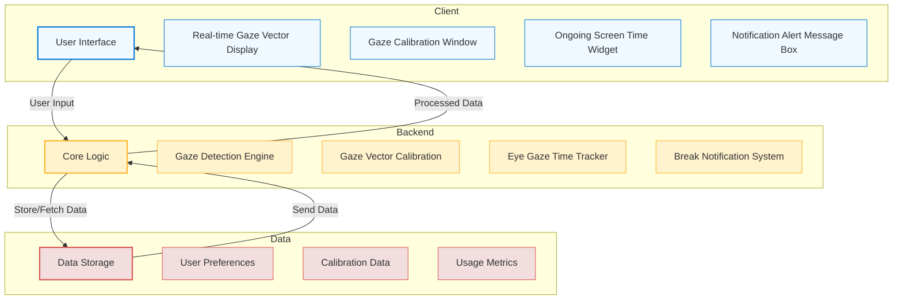
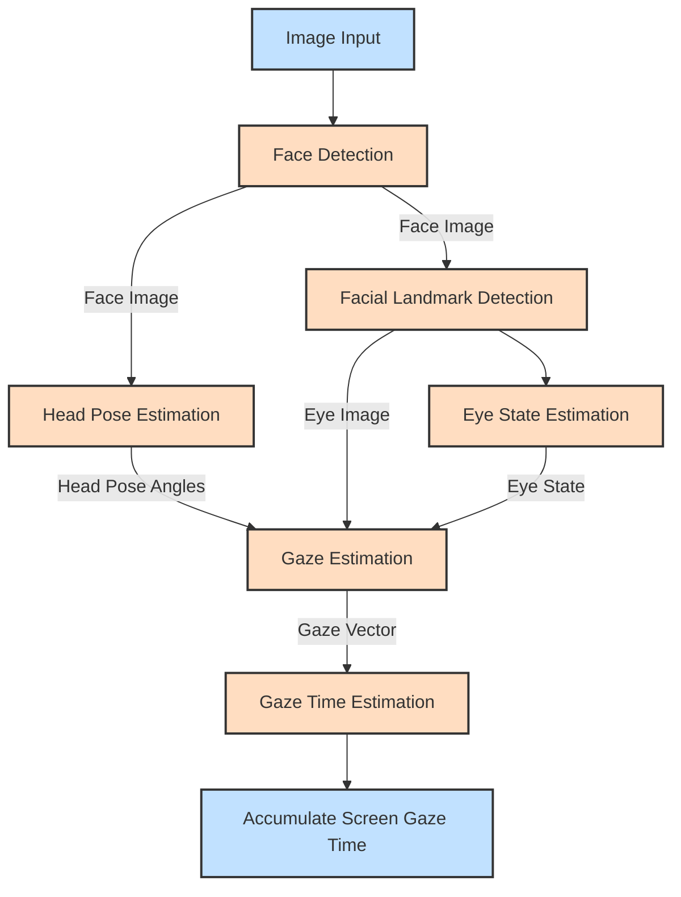

# VisionGuard Architecture

## High-Level Architecture

### VisionGuard Backend

The VisionGuard backend is powered by the OpenVINO model zoo to estimate a user’s gaze and calculate the accumulated screen gaze time. The following models are integral to the backend, each playing a crucial role in the processing pipeline:

- **Face Detection Model:** Identifies the locations of faces within an image, serving as the first step in the gaze estimation process. Supported networks include:
  - [`face-detection-retail-0005`](https://docs.openvino.ai/2024/omz_models_model_face_detection_retail_0005.html)
  - [`face-detection-retail-0004`](https://docs.openvino.ai/2024/omz_models_model_face_detection_retail_0004.html)
  - [`face-detection-adas-0001`](https://docs.openvino.ai/2024/omz_models_model_face_detection_adas_0001.html)

- **Head Pose Estimation Model:** Estimates the head pose in [Tait-Bryan angles](https://en.wikipedia.org/wiki/Euler_angles#Tait–Bryan_angles), outputting yaw, pitch, and roll angles in degrees, which are crucial inputs for the gaze estimation model:
  - [`head-pose-estimation-adas-0001`](https://docs.openvino.ai/2024/omz_models_model_head_pose_estimation_adas_0001.html)

- **Facial Landmark Detection Model:** Determines the coordinates of key facial landmarks, particularly around the eyes, which are necessary for precise gaze estimation. Supported networks include:
  - [`facial-landmarks-35-adas-0002`](https://docs.openvino.ai/2024/omz_models_model_facial_landmarks_35_adas_0002.html)
  - [`facial-landmarks-98-detection-0001`](https://docs.openvino.ai/2022.3/omz_models_model_facial_landmarks_98_detection_0001.html)

- **Eye State Estimation Model:** Assesses whether the eyes are open or closed, an important factor in determining gaze direction:
  - [`open-closed-eye-0001`](https://docs.openvino.ai/2022.3/omz_models_model_open_closed_eye_0001.html)

- **Gaze Estimation Model:** Utilizes inputs from both eyes and the head pose angles to output a 3D vector representing the direction of a person’s gaze in Cartesian coordinates:
  - [`gaze-estimation-adas-0002`](https://docs.openvino.ai/2024/omz_models_model_gaze_estimation_adas_0002.html)

### Processing Pipeline

The following diagram illustrates the processing pipeline in VisionGuard, demonstrating how different models interact to produce accurate gaze estimation:

