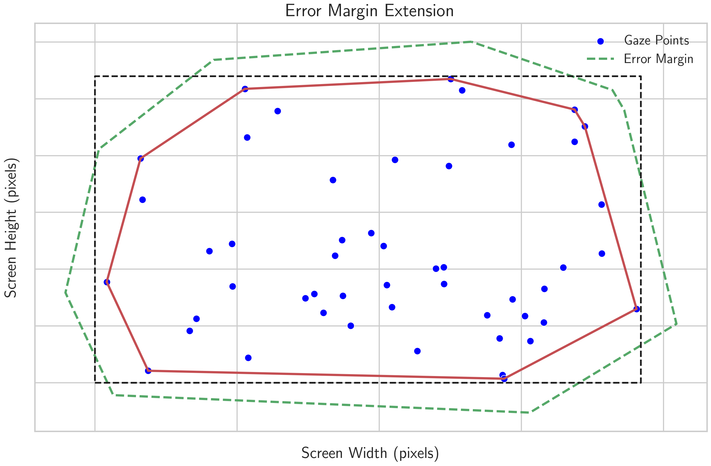
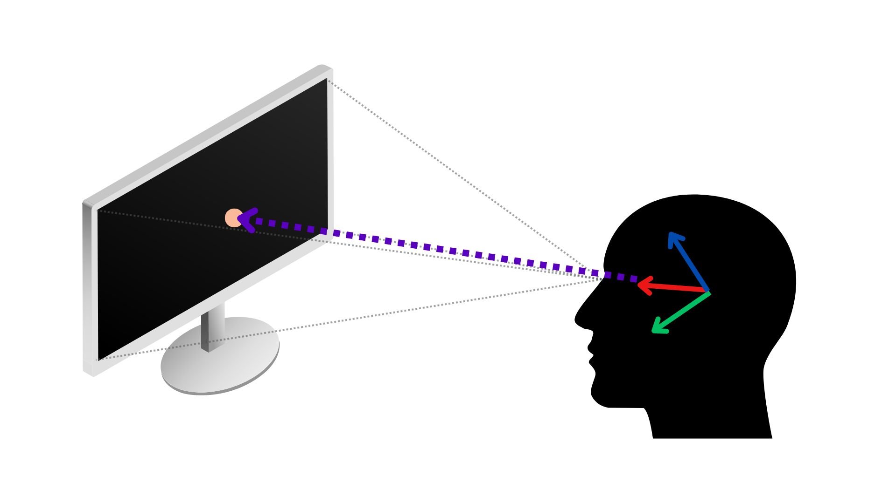

# VisionGuard Architecture

## Table of Contents

1. [High-Level Architecture](#high-level-architecture)
2. [Detailed Components](#detailed-components)
   - [Client](#client)
   - [Backend](#backend)
   - [Data Storage](#data-storage)
3. [Calibration Process](#calibration-process)
4. [Backend Processing Pipeline](#backend-processing-pipeline)
5. [Frame Processing and Gaze Time Update](#frame-processing-and-gaze-time-update)
6. [Metric Calculation](#metric-calculation)
7. [Performance Calculation](#performance-calculation)
8. [Notification Alert System](#notification-alert-system)
9. [Statistics Calculation](#statistics-calculation)
10. [Data Management](#data-management)

## High-Level Architecture

## Detailed Components

### Client

The client consists of two main components:

1. **Main Window Application**: Runs in the foreground and provides the primary user interface.
2. **System Tray Application**: Runs in the background within the OS system tray.

### Backend

- Core Logic
- Gaze Detection Engine
- Gaze Vector Calibration
- Eye Gaze Time Tracker
- Break Notification System
- Metric Calculator
- Performance Calculator
- Statistics Calculator

### Data Storage

- Usage Metrics: Stores data on user's screen time

For a detailed architectural overview of each component, please refer to the [Detailed Component Architecture](DETAILED_ARCHITECTURE.md) document.

## Calibration Process

### Detailed Calibration Steps

### Calibration Process Flow

#### a. Four-Point Gaze Capture

[Diagram: Four-Point Calibration Screen]
Description: A full-screen view with four numbered green dots in the corners and center text guiding the user.

Process:

1. Look at each green dot as it appears for 1.2 seconds.
2. Multiple gaze points are captured for each corner.

#### b. Convex Hull Calculation

<!--  -->

Process:

1. All captured gaze points are combined.
2. A convex hull algorithm finds the smallest polygon enclosing all points.

#### c. Error Margin Application

<!--  -->

Process:

1. The convex hull is extended by the specified error margin (default: 150 pixels).
2. This accounts for potential gaze tracking inaccuracies.

#### d. Final Calibration Point Determination

<!--  -->

Process:

1. The extended convex hull is intersected with screen boundaries.
2. The four corners of this intersection become the final calibration points.

## Backend Processing Pipeline

1. **Image Input**: Raw frame from the camera.
2. **Face Detection**: Locates faces in the image.
3. **Facial Landmark Detection**: Identifies key facial points.
4. **Head Pose Estimation**: Determines the orientation of the head.
5. **Eye State Estimation**: Checks if eyes are open or closed.
6. **Gaze Estimation**: Calculates the gaze vector.
7. **Gaze Time Estimation**: Determines if the gaze is on the screen.
8. **Screen Gaze Time Accumulation**: Updates the total screen time.
9. **Usage Metrics Update**: Records the latest usage data.
10. **Break Notification Trigger**: Initiates break alerts if necessary.

### VisionGuard Core

The VisionGuard Core is powered by the OpenVINO model zoo to estimate a user's gaze and calculate the accumulated screen gaze time. The following models are integral to the backend, each playing a crucial role in the processing pipeline:

- **Face Detection Model:** Identifies the locations of faces within an image, serving as the first step in the gaze estimation process. Supported networks include:
  - [`face-detection-retail-0005`](https://docs.openvino.ai/2024/omz_models_model_face_detection_retail_0005.html)
  - [`face-detection-retail-0004`](https://docs.openvino.ai/2024/omz_models_model_face_detection_retail_0004.html)
  - [`face-detection-adas-0001`](https://docs.openvino.ai/2024/omz_models_model_face_detection_adas_0001.html)

- **Head Pose Estimation Model:** Estimates the head pose in [Tait-Bryan angles](https://en.wikipedia.org/wiki/Euler_angles#Tait–Bryan_angles), outputting yaw, pitch, and roll angles in degrees, which are crucial inputs for the gaze estimation model:
  - [`head-pose-estimation-adas-0001`](https://docs.openvino.ai/2024/omz_models_model_head_pose_estimation_adas_0001.html)

- **Facial Landmark Detection Model:** Determines the coordinates of key facial landmarks, particularly around the eyes, which are necessary for precise gaze estimation. Supported networks include:
  - [`facial-landmarks-35-adas-0002`](https://docs.openvino.ai/2024/omz_models_model_facial_landmarks_35_adas_0002.html)
  - [`facial-landmarks-98-detection-0001`](https://docs.openvino.ai/2022.3/omz_models_model_facial_landmarks_98_detection_0001.html)

- **Eye State Estimation Model:** Assesses whether the eyes are open or closed, an important factor in determining gaze direction:
  - [`open-closed-eye-0001`](https://docs.openvino.ai/2022.3/omz_models_model_open_closed_eye_0001.html)

- **Gaze Estimation Model:** Utilizes inputs from both eyes and the head pose angles to output a 3D vector representing the direction of a person's gaze in Cartesian coordinates:
  - [`gaze-estimation-adas-0002`](https://docs.openvino.ai/2024/omz_models_model_gaze_estimation_adas_0002.html)

For a detailled overview of the low level architecture refer to the [wikipage](https://github.com/inbasperu/VisionGuard/wiki/Gaze-Detection-Engine-Architecture)

### Processing Pipeline

The following diagram illustrates the processing pipeline in VisionGuard, demonstrating how different models interact to produce accurate gaze estimation:

## Frame Processing and Gaze Time Update Algorithm

The VisionGuard system processes each video frame to determine the user's gaze direction and update screen time metrics. Here's a high-level overview of the algorithm:

1. **Face and Gaze Detection**: Detect faces and estimate gaze direction.
2. **Gaze Screen Intersection**: Convert 3D gaze vector to 2D screen point.
3. **Gaze Time Update**: Update screen time or gaze lost duration.
4. **Visual Feedback**: Display detection results and metrics.
5. **Performance Tracking**: Update resource utilization data.

### Gaze Screen Intersection

The following image illustrates how the gaze vector intersects with the screen:

This visualization helps understand how the 3D gaze vector is projected onto the 2D screen space.

### Point-in-Polygon Algorithm

To determine if the gaze point is within the screen boundaries, VisionGuard uses a ray-casting algorithm, which is a common method for solving the point-in-polygon problem. Here's a visual representation of how this algorithm works:

Image credit: [Wikimedia Commons](https://commons.wikimedia.org/wiki/File:RecursiveEvenPolygon.svg)

The algorithm works as follows:

- Cast a ray from the gaze point to infinity (usually along the x-axis)
- Count the number of intersections with the polygon's edges
- If the count is odd, the point is inside the polygon; if even, it's outside

This method is efficient and works for both convex and concave polygons, making it suitable for various screen shapes and calibration setups. The test also works in three dimensions, which is particularly useful for VisionGuard's 3D gaze estimation.

For more detailed information about this algorithm, please refer to the [Point in polygon](https://en.wikipedia.org/wiki/Point_in_polygon) article on Wikipedia.

This algorithm provides a robust way to determine if the user's gaze is directed at the screen, allowing VisionGuard to accurately track screen time and manage break notifications.

## Metric Calculation

The Metric Calculator computes usage metrics:

- Total screen time
- Continuous gaze away durations

## Performance Calculation

The Performance Calculator analyzes system performance and resource usage:

1. CPU Utilization: Tracks CPU usage of the VisionGuard application.
2. Memory Usage: Monitors RAM consumption.
3. Frame Processing Speed: Calculates frames per second for video processing.
4. Latency of inference: Calculates latency in milliseconds for video processing.

## Notification Alert System

The Break Notification System manages alerts based on user settings and gaze behavior:

1. Break Reminders: Triggered after prolonged screen time.
2. Custom Alerts: User-defined notifications based on specific conditions.

## Statistics Calculation

The Statistics Calculator generates comprehensive reports on usage patterns:

1. Daily Usage Summary: Screen time, break frequency, and duration per day.
2. Weekly Trends: Week-over-week comparisons of usage patterns.
3. Mean Screen Time: Mean screen time on a daily and weekly basis.

## Data Management

The only data that is persisted and stored locally is the screen time statistics. The weekly statistics are maintained, and once the data becomes older than a week, the stale data is automatically cleared.
