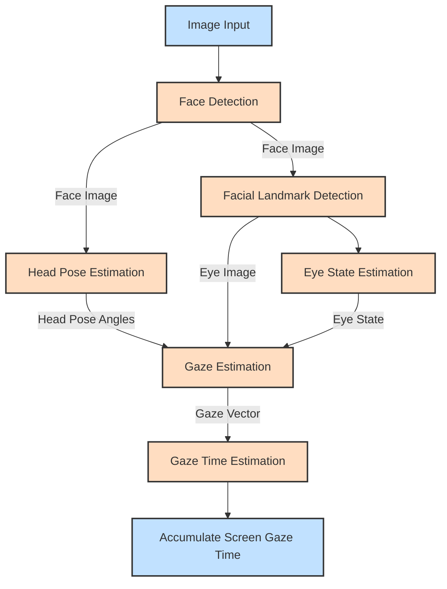

# VisionGuard: My Google Summer of Code 2024 Experience with OpenVINO

As I wrap up my 16-week journey with Google Summer of Code (GSoC) 2024, I'm excited to present *VisionGuard*—a desktop application designed to help reduce eye strain and promote healthier screen usage. Developed in collaboration with the [OpenVINO Toolkit](https://github.com/openvinotoolkit) team, VisionGuard represents a personal and technical milestone for me, as it brings advanced computer vision to a very practical, everyday problem.

## The Beginning: My Path to GSoC

I’m Inbasekaran Perumal, a recent graduate from the National Institute of Technology, Surathkal, Karnataka (class of 2024), where I completed my undergraduate education specializing in Electronics & Communication Engineering. My interest in how hardware and software work together has always driven me, especially when it comes to integrating AI and machine learning into real-world applications. I’ve always been fascinated by technologies like computer vision and image processing, which made OpenVINO an ideal open-source project for me.

My first proper techinical introduction to OpenVINO came during a talk led by Intel experts, hosted by one of my professors Prof.[Sumam David](https://sumam.nitk.ac.in). This hands-on experience in executing neural network inference on Intel FPGAs sparked my interest. From that moment, I knew I wanted to contribute to OpenVINO and gain a deeper understanding of how it works while applying my skills to meaningful projects.

I had heard about Google Summer of Code during my freshmen year at university, particularly through seniors who actively participated in open-source programs like GSoC. Initially, the idea of contributing to a global open-source project seemed daunting. I questioned whether I had the skills or experience to be part of such a prestigious initiative. However, but with encouragement from my professors, Prof. [Mohit P. Tahiliani](https://cse.nitk.ac.in/faculty/mohit-p-tahiliani) and Prof.[Ramesh Kini](https://ece.nitk.ac.in/faculty/ramesh-kini-m) and the motivation from seniors who had successfully participated in GSoC, I decided to take the leap.

Contributing to C++-based open-source projects can be intimidating at first, especially for beginners. I hope to write a detailed guide someday to help others get started in this area.

## The Vision Behind VisionGuard

The concept for *VisionGuard* is close to my heart. Like many of us, I experienced the negative effects of long hours spent in front of screens—strained eyes, disrupted sleep, and overall discomfort, particularly during the remote semesters of the COVID era. VisionGuard is designed to monitor your screen time and encourage healthier habits by using your computer’s webcam to track your gaze. 

The tool operates locally to ensure privacy, with the added benefit of leveraging Neural Processing Units (NPUs) for efficient AI inference, balancing performance with data security.

## Project Overview

[VisionGuard](https://github.com/inbasperu/VisionGuard) is a privacy-focused screen time management tool that uses your computer's webcam to monitor your gaze and encourage healthy viewing habits. By operating entirely locally and supporting inference on AI PC's Neural Processing Units (NPUs), VisionGuard offers a unique blend of functionality, performance, and data security.

## Key Features

During the GSoC period, I successfully implemented the following features:

1. **Real-time Eye Gaze Tracking**: Integrated OpenVINO’s [gaze detection engine](https://github.com/inbasperu/VisionGuard/wiki/Gaze-Detection-Engine-Architecture) to accurately track user gaze without compromising privacy.
2. **Customizable Break Notifications**: Developed a smart alert system that reminds users to take breaks based on the [20-20-20 rule](https://www.healthline.com/health/eye-health/20-20-20-rule).
3. **Comprehensive Statistics**: Built a statistics calculator to provide daily and weekly screen time insights.
4. **Flexible Device Support**: Enabled seamless switching between CPU, GPU, and NPU for inference, optimizing performance across hardware configurations.
5. **Multi-Camera Compatibility**: Supported up to five camera devices for enhanced flexibility.
6. **Aesthetic Customization**: Designed both dark and light themes for user preference.
7. **Resource Optimization**: Integrated a system resource monitor and frame processing limits to ensure efficient performance.
8. **System Tray Integration**: Developed a system tray application for quick access to key features without desktop clutter.

## Technical Deep Dive

```mermaid
%%{init: {'theme': 'base', 'themeVariables': { 'background': '#ffffff' }}}%%
graph TD
    subgraph Client
        UI[User Interface]
        GVD[Gaze Vector Display]
        GCW[Calibration Window]
        STW[Screen Time Widget]
        STS[Statistics Window]
        CPR[Camera Permission Request]
        RCK[Run-Time Control Keys]
    end

    subgraph Backend
        CL[Core Logic]
        GDM[Gaze Detection Engine]
        GVC[Gaze Vector Calibration]
        EGT[Eye Gaze Time Tracker]
        BNS[Break Notification System]
        SC[Statistics Calculator]
        MC[Metric Calculator]
        PC[Performance Calculator]
    end

    subgraph Data
        UM[Usage Metrics]
    end

    UI <-->|Input/Output| CL
    CPR -->|Permission Status| CL
    RCK -->|Control Commands| CL
    CL <--> UM
    CL <--> GDM
    CL <--> GVC
    CL <--> EGT
    CL --> BNS
    CL <--> SC
    CL <--> MC
    CL <--> PC
    
    BNS --> UI
    CL --> GVD
    CL --> GCW
    CL --> STW
    SC --> STS
    PC --> UI

    style UI fill:#f0f9ff,stroke:#0275d8,stroke-width:2px
    style GVD fill:#f0f9ff,stroke:#0275d8,stroke-width:1px
    style GCW fill:#f0f9ff,stroke:#0275d8,stroke-width:1px
    style STW fill:#f0f9ff,stroke:#0275d8,stroke-width:1px
    style STS fill:#f0f9ff,stroke:#0275d8,stroke-width:1px
    style CPR fill:#f0f9ff,stroke:#0275d8,stroke-width:1px
    style RCK fill:#f0f9ff,stroke:#0275d8,stroke-width:1px
    style CL fill:#fff3cd,stroke:#ffb22b,stroke-width:2px
    style GDM fill:#fff3cd,stroke:#ffb22b,stroke-width:1px
    style GVC fill:#fff3cd,stroke:#ffb22b,stroke-width:1px
    style EGT fill:#fff3cd,stroke:#ffb22b,stroke-width:1px
    style BNS fill:#fff3cd,stroke:#ffb22b,stroke-width:1px
    style SC fill:#fff3cd,stroke:#ffb22b,stroke-width:1px
    style MC fill:#fff3cd,stroke:#ffb22b,stroke-width:1px
    style PC fill:#fff3cd,stroke:#ffb22b,stroke-width:1px
    style UM fill:#f2dede,stroke:#d9534f,stroke-width:1px
```

For a detailed architectural overview of each component, please refer to the [Detailed Component Architecture](DETAILED_ARCHITECTURE.md) document.

### Client

The client consists of two main components:

1. **Main Window Application**: Provides the primary user interface.
2. **System Tray Application**: Runs in the background within the OS system tray.

### Gaze Detection Engine

The heart of VisionGuard is its gaze detection engine, leveraging several models from the OpenVINO model zoo:

- Face Detection: [`face-detection-retail-0005`](https://docs.openvino.ai/2024/omz_models_model_face_detection_retail_0005.html)
- Head Pose Estimation: [`head-pose-estimation-adas-0001`](https://docs.openvino.ai/2024/omz_models_model_head_pose_estimation_adas_0001.html)
- Facial Landmark Detection: [`facial-landmarks-35-adas-0002`](https://docs.openvino.ai/2024/omz_models_model_facial_landmarks_35_adas_0002.html)
- Eye State Estimation: [`open-closed-eye-0001`](https://docs.openvino.ai/2022.3/omz_models_model_open_closed_eye_0001.html)
- Gaze Estimation: [`gaze-estimation-adas-0002`](https://docs.openvino.ai/2024/omz_models_model_gaze_estimation_adas_0002.html)

These models work together to create a robust gaze detection pipeline.

### Calibration Process

One of the most critical aspects of ensuring VisionGuard’s accuracy is the calibration process. Accurate calibration is essential for precise gaze tracking, as it directly influences how well the application can detect and respond to where the user is looking on the screen. The calibration process I developed is both user-friendly and technically robust, designed to adapt to various screen sizes and user positions.

#### Four-Point Gaze Capture

The calibration process begins with a **Four-Point Gaze Capture**. Users are prompted to focus on four green dots that appear sequentially in the corners of the screen. This step is crucial for gathering data on the user's gaze behavior from different angles. The process ensures that multiple gaze points are captured for each corner, improving the overall accuracy of the calibration.

  

*Figure: A screen with four green dots representing the four-point calibration process.*

#### Convex Hull Calculation

Once the gaze data is captured, the next step is the **Convex Hull Calculation**. The system takes all the captured gaze points and computes the smallest polygon that can enclose these points, known as the convex hull. This polygon represents the boundary within which the user's gaze is expected to fall.

  

*Figure: Visualization of the convex hull enclosing the captured gaze points.*

#### Error Margin Application

To account for potential inaccuracies in gaze detection, an **Error Margin Application** is performed. The convex hull is expanded by a predetermined margin (typically 150 pixels) to create a buffer zone. This extension ensures that slight deviations in gaze tracking won’t lead to incorrect detections.

  

*Figure: The error margin applied to the convex hull to account for tracking inaccuracies.*

#### Final Calibration Point Determination

The final step in the calibration process is determining the **Final Calibration Points**. The extended convex hull is intersected with the screen boundaries, and the resulting points form the final calibration set. These points are crucial for accurate gaze tracking, ensuring that the system can reliably detect whether the user is looking at the screen.

  

*Figure: The final calibration points determined after applying the error margin.*

This comprehensive calibration process not only improves accuracy but also enhances the user experience by making the setup process straightforward and reliable.

### Frame Processing and Gaze Time Update Algorithm

At the core of VisionGuard’s functionality is its ability to process video frames in real time and update gaze-related metrics. This system works by analyzing each frame captured by the webcam to determine the user’s gaze direction and then updating the screen time metrics accordingly.

#### Face and Gaze Detection

The process starts with **Face and Gaze Detection**. Using models from the OpenVINO toolkit, the application first detects the user’s face and then estimates their gaze direction. This step is critical as it forms the basis for all subsequent calculations.

  

*Figure: The face and gaze detection process, which identifies the user’s gaze direction.*

#### Gaze Screen Intersection

Once the gaze direction is estimated, the next step is to calculate the **Gaze Screen Intersection**. Here, the 3D gaze vector is projected onto the 2D screen plane. This conversion is essential to determine whether the user is looking at the screen and, if so, where on the screen their gaze is focused.

  

*Figure: Illustration of the gaze vector intersecting with the 2D screen plane.*

#### Gaze Time Update

Based on the intersection point, the system then performs a **Gaze Time Update**. If the user’s gaze is on the screen and their eyes are open, the application accumulates screen time. Conversely, if the gaze is off the screen or the eyes are closed, the system updates the gaze lost duration. If this duration exceeds a specified threshold, the accumulated screen time is reset.

  

*Figure: Flowchart showing how gaze time is updated based on user behavior.*

#### Visual Feedback and Performance Metrics

Finally, the system provides **Visual Feedback** by marking detected facial features and displaying the current gaze time and lost duration on the frame. Alongside this, **Performance Metrics** such as CPU utilization, memory usage, and frame processing speed are tracked to ensure that VisionGuard runs efficiently.

  

*Figure: Example of visual feedback provided by VisionGuard, along with performance metrics.*

### Point-in-Polygon Algorithm

Determining whether the user's gaze is within the screen boundaries is a critical task that VisionGuard accomplishes using a **Point-in-Polygon Algorithm**. Specifically, VisionGuard employs a ray-casting technique, which is a widely-used method for solving this problem.

#### How the Algorithm Works

The algorithm works by casting a ray from the gaze point and counting the number of intersections this ray has with the edges of the polygon representing the screen area. If the number of intersections is odd, the point lies inside the polygon; if even, it lies outside. This method is effective for both convex and concave polygons, making it highly adaptable.

  

*Figure: Diagram illustrating how the ray-casting algorithm determines if a point is inside a polygon.*

The Point-in-Polygon algorithm is particularly suited for VisionGuard’s 3D gaze estimation as it accurately maps the 3D gaze vector onto the 2D screen space. This mapping is crucial for reliable screen time tracking and ensuring that users receive timely notifications to take breaks.

### Challenges and Learning

Throughout the GSoC experience, I encountered numerous challenges that significantly contributed to my learning and growth as a developer:

- **Cross-platform C++ Development**: Developing a cross-platform C++ application presented unique challenges, particularly in ensuring compatibility across different operating systems like macOS, Windows, and Linux. I faced difficulties with different compilers, such as issues compiling OpenVINO’s Model Zoo demo with MSVC 2022, which required troubleshooting and problem-solving to ensure smooth builds across platforms.
  
- **Understanding and Implementing CMake**: CMake, a powerful build system, required me to deepen my understanding of build configurations and dependencies. This knowledge was essential in managing the complexity of a cross-platform project like VisionGuard.

- **Low-Level Design Issues**: Navigating C++'s low-level design complexities, particularly with object-oriented principles (OOP), was challenging. Implementing robust design patterns while maintaining performance required careful consideration of memory management and efficiency.

- **Screen Calibration for Accurate Gaze Detection**: One of the more technically demanding tasks was calibrating the screen to accurately detect if the user was gazing at the screen. This required developing a reliable and user-friendly calibration process that could adapt to different screen sizes and user positions.

- **Adhering to C++ Development Standards**: Ensuring that VisionGuard adhered to modern C++ development standards was vital for the project’s long-term maintainability. I had to revise my approach to permissions and data storage, moving from storing stats in the current working directory to using appropriate libraries for handling resources securely and efficiently.

These challenges not only helped me improve VisionGuard but also significantly enhanced my problem-solving skills and understanding of cross-platform development.

## Future Work

While I'm proud of what I've accomplished during the GSoC period, there's always room for improvement. Some areas for future development include:

1. Implementing comprehensive unit tests to ensure reliability and maintainability
2. Developing GitHub workflows for automated building, testing, and linting
3. Adding support for multi-monitor setups and multi-user environments
4. Enhancing the statistics and reporting features for more detailed insights

## Conclusion

My GSoC journey with OpenVINO and VisionGuard has been an incredible learning experience. I've had the opportunity to work with cutting-edge technology, collaborate with talented mentors, and create a tool that I believe can make a real difference in people's lives.

I want to express my heartfelt gratitude to my mentors, [Dmitriy Pastushenkov](https://github.com/DimaPastushenkov), [Ria Cheruvu](https://github.com/riacheruvu) for their guidance and support throughout this journey. I also want to thank the entire OpenVINO Toolkit community for their invaluable resources and assistance.

If you're interested in trying out VisionGuard or contributing to its development, please check out our [GitHub repository](https://github.com/inbasperu/VisionGuard). Your feedback and contributions are always welcome!

## References

1. [VisionGuard GitHub Repository](https://github.com/inbasperu/VisionGuard)
2. [OpenVINO Toolkit](https://github.com/openvinotoolkit)
3. [Google Summer of Code](https://summerofcode.withgoogle.com/)
4. [OpenVINO Model Zoo](https://github.com/openvinotoolkit/open_model_zoo)
5. [20-20-20 Rule for Eye Strain](https://www.healthline.com/health/eye-health/20-20-20-rule)
6. [Point in Polygon Algorithm](https://en.wikipedia.org/wiki/Point_in_polygon)
7. [Convex Hull Algorithm](https://en.wikipedia.org/wiki/Convex_hull_algorithms)
8. [Tait-Bryan Angles](https://en.wikipedia.org/wiki/Euler_angles#Tait–Bryan_angles)
