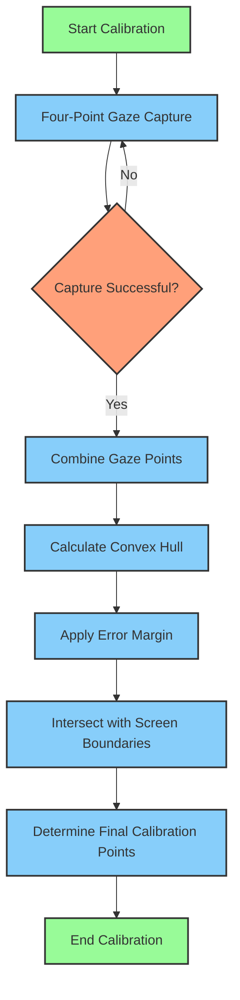
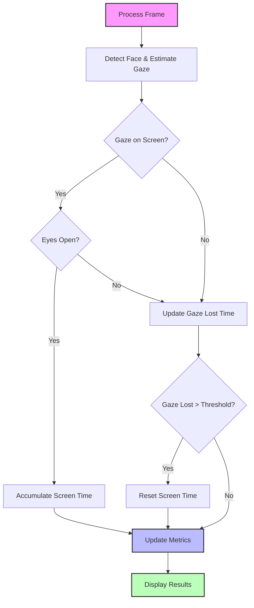

# VisionGuard Architecture

## Table of Contents

1. [Overview](#overview)
2. [High-Level Architecture](#high-level-architecture)
3. [Detailed Components](#detailed-components)
   - [Client](#client)
   - [Backend](#backend)
   - [Data Storage](#data-storage)
4. [Key Processes](#key-processes)
   - [Calibration Process](#calibration-process)
   - [Backend Processing Pipeline](#backend-processing-pipeline)
   - [Frame Processing and Gaze Time Update](#frame-processing-and-gaze-time-update)
5. [Core Functionalities](#core-functionalities)
   - [Metric Calculation](#metric-calculation)
   - [Performance Calculation](#performance-calculation)
   - [Notification Alert System](#notification-alert-system)
   - [Statistics Calculation](#statistics-calculation)
6. [Data Management](#data-management)
7. [Technical Details](#technical-details)
   - [VisionGuard Core](#visionguard-core)
   - [Gaze Screen Intersection](#gaze-screen-intersection)
   - [Point-in-Polygon Algorithm](#point-in-polygon-algorithm)

## Overview

VisionGuard is an advanced application designed to monitor and manage screen time through gaze detection and analysis. This document outlines the architectural design of VisionGuard, providing insights into its components, processes, and core functionalities.

## High-Level Architecture

```mermaid
graph TD
    subgraph Client
        UI[User Interface]
        GVD[Gaze Vector Display]
        GCW[Calibration Window]
        STW[Screen Time Widget]
        STS[Statistics Window]
        CPR[Camera Permission Request]
        RCK[Run-Time Control Keys]
    end

    subgraph Backend
        CL[Core Logic]
        GDM[Gaze Detection Engine]
        GVC[Gaze Vector Calibration]
        EGT[Eye Gaze Time Tracker]
        BNS[Break Notification System]
        SC[Statistics Calculator]
        MC[Metric Calculator]
        PC[Performance Calculator]
    end

    subgraph Data
        UM[Usage Metrics]
    end

    UI <-->|Input/Output| CL
    CPR -->|Permission Status| CL
    RCK -->|Control Commands| CL
    CL <--> UM
    CL <--> GDM
    CL <--> GVC
    CL <--> EGT
    CL --> BNS
    CL <--> SC
    CL <--> MC
    CL <--> PC
    
    BNS --> UI
    CL --> GVD
    CL --> GCW
    CL --> STW
    SC --> STS
    PC --> UI

    style UI fill:#f0f9ff,stroke:#0275d8,stroke-width:2px
    style GVD fill:#f0f9ff,stroke:#0275d8,stroke-width:1px
    style GCW fill:#f0f9ff,stroke:#0275d8,stroke-width:1px
    style STW fill:#f0f9ff,stroke:#0275d8,stroke-width:1px
    style STS fill:#f0f9ff,stroke:#0275d8,stroke-width:1px
    style CPR fill:#f0f9ff,stroke:#0275d8,stroke-width:1px
    style RCK fill:#f0f9ff,stroke:#0275d8,stroke-width:1px
    style CL fill:#fff3cd,stroke:#ffb22b,stroke-width:2px
    style GDM fill:#fff3cd,stroke:#ffb22b,stroke-width:1px
    style GVC fill:#fff3cd,stroke:#ffb22b,stroke-width:1px
    style EGT fill:#fff3cd,stroke:#ffb22b,stroke-width:1px
    style BNS fill:#fff3cd,stroke:#ffb22b,stroke-width:1px
    style SC fill:#fff3cd,stroke:#ffb22b,stroke-width:1px
    style MC fill:#fff3cd,stroke:#ffb22b,stroke-width:1px
    style PC fill:#fff3cd,stroke:#ffb22b,stroke-width:1px
    style UM fill:#f2dede,stroke:#d9534f,stroke-width:1px
```

## Detailed Components

### Client

The client consists of two main components:

1. **Main Window Application**: Runs in the foreground and provides the primary user interface.
2. **System Tray Application**: Runs in the background within the OS system tray.

### Backend

- Core Logic
- Gaze Detection Engine
- Gaze Vector Calibration
- Eye Gaze Time Tracker
- Break Notification System
- Metric Calculator
- Performance Calculator
- Statistics Calculator

### Data Storage

- Usage Metrics: Stores data on user's screen time

For a detailed architectural overview of each component, please refer to the [Detailed Component Architecture](DETAILED_ARCHITECTURE.md) document.

## Key Processes

### Calibration Process

The calibration process ensures accurate gaze detection and screen time tracking. It involves the following steps:

1. Four-Point Gaze Capture
2. Convex Hull Calculation
3. Error Margin Application
4. Final Calibration Point Determination

### Backend Processing Pipeline

The backend processing pipeline involves several steps to accurately detect gaze and update screen time:

1. Image Input
2. Face Detection
3. Facial Landmark Detection
4. Head Pose Estimation
5. Eye State Estimation
6. Gaze Estimation
7. Gaze Time Estimation
8. Screen Gaze Time Accumulation
9. Usage Metrics Update
10. Break Notification Trigger

### Frame Processing and Gaze Time Update

## Core Functionalities

### Metric Calculation

The Metric Calculator computes usage metrics such as total screen time and continuous gaze away durations.

### Performance Calculation

The Performance Calculator analyzes system performance and resource usage, including CPU utilization, memory usage, frame processing speed, and latency of inference.

### Notification Alert System

The Break Notification System manages alerts based on user settings and gaze behavior, including break reminders and custom alerts.

### Statistics Calculation

The Statistics Calculator generates comprehensive reports on usage patterns, including daily usage summaries, weekly trends, and mean screen time.

## Data Management

VisionGuard implements the following data management practices:

- Only screen time statistics are persisted and stored locally.
- Weekly statistics are maintained, with stale data (older than a week) automatically cleared.

## Technical Details

### VisionGuard Core

VisionGuard Core utilizes the OpenVINO model zoo for gaze estimation and screen time calculation. Key models include:

- Face Detection Model
- Head Pose Estimation Model
- Facial Landmark Detection Model
- Eye State Estimation Model
- Gaze Estimation Model

For a detailed overview of the low-level architecture, refer to the [Gaze Detection Engine Architecture](https://github.com/inbasperu/VisionGuard/wiki/Gaze-Detection-Engine-Architecture) wiki page.

### Gaze Screen Intersection

The system converts the 3D gaze vector to a 2D point on the screen to determine if the user's gaze is directed at the screen.

### Point-in-Polygon Algorithm

VisionGuard uses a ray-casting algorithm to determine if the gaze point is within the screen boundaries. This method is efficient and works for both convex and concave polygons.

For more information on performance monitoring and metrics, refer to the [Presenter Class Documentation](https://github.com/inbasperu/VisionGuard/wiki/Presenter-Class-Documentation) and [PerformanceMetrics Class Documentation](https://github.com/inbasperu/VisionGuard/wiki/PerformanceMetrics-Class-Documentation) wiki pages.