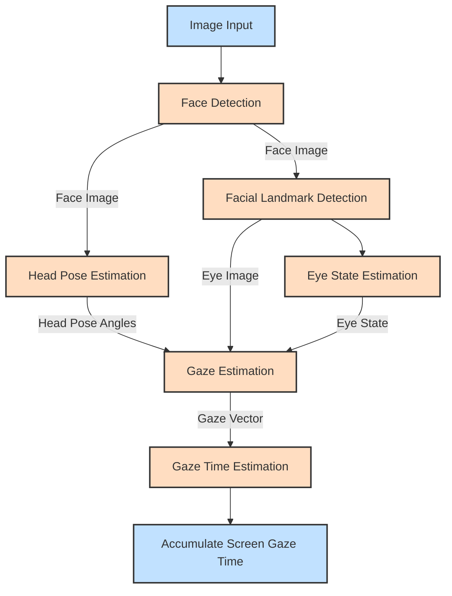
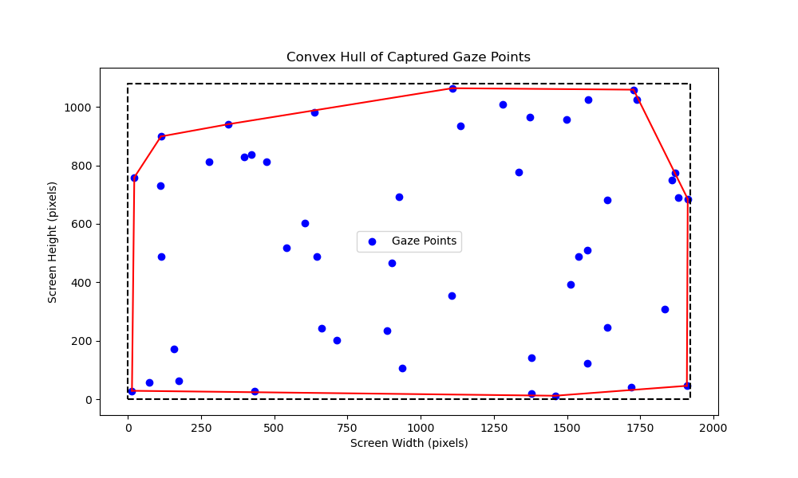
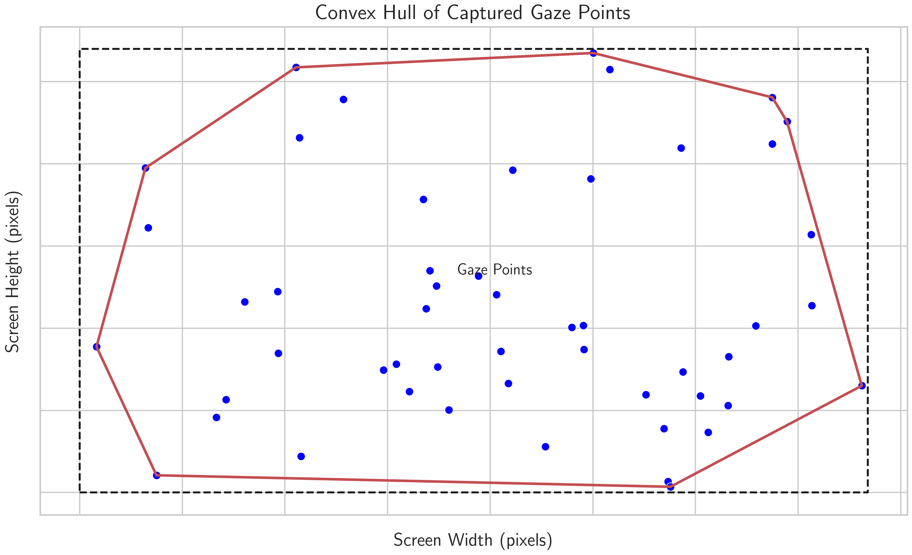
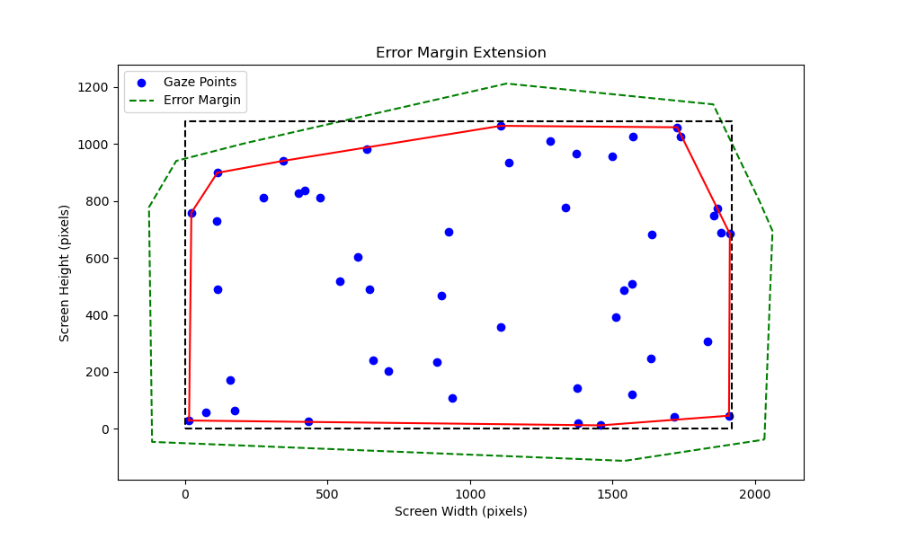
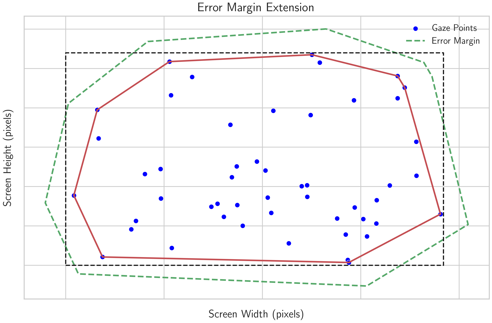
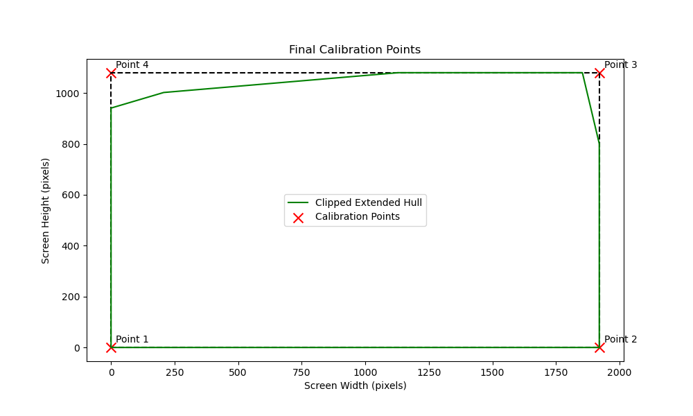
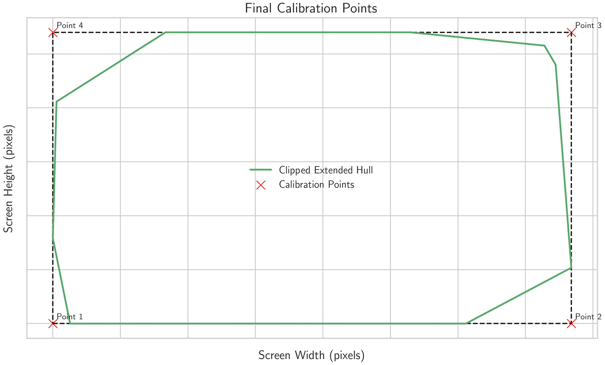
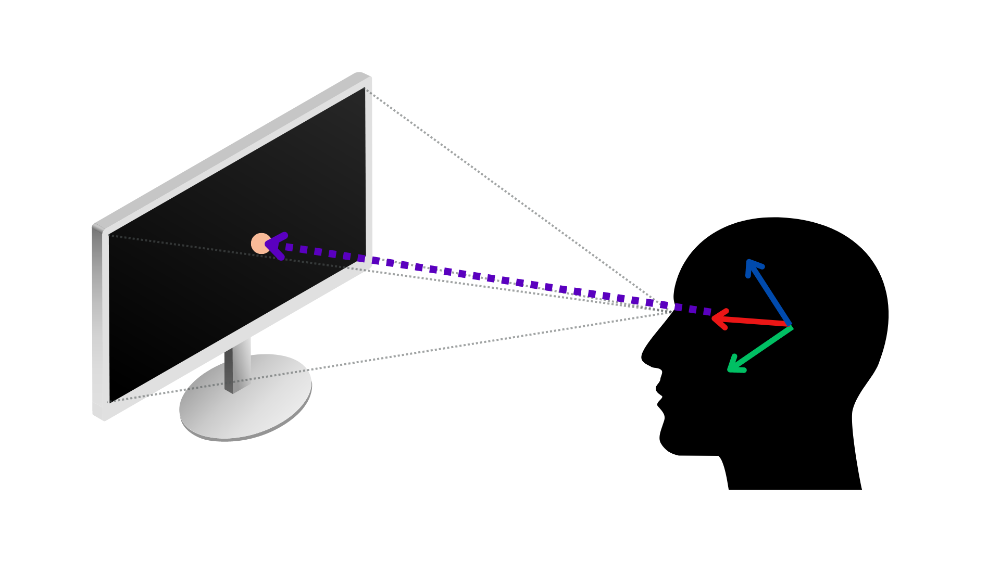

# VisionGuard: A Journey Through Google Summer of Code 2024 with OpenVINO

As the sun sets on my 16-week journey with Google Summer of Code (GSoC) 2024, I'm thrilled to share the fruits of my labor: VisionGuard, an innovative desktop application designed to combat eye strain and promote healthier computing habits. This project, developed under the mentorship of the [OpenVINO Toolkit](https://github.com/openvinotoolkit) team, represents a significant step forward in leveraging advanced computer vision technology for personal well-being.

## Project Overview

[VisionGuard](https://github.com/inbasperu/VisionGuard) is a privacy-focused screen time management tool that uses your computer's webcam to monitor your gaze and encourage healthy viewing habits. By operating entirely locally and supporting inference on AI PC's Neural Processing Units (NPUs), VisionGuard offers a unique blend of functionality, performance, and data security.

## Key Features Implemented

During the GSoC period, I successfully implemented the following features:

1. **Real-time Eye Gaze Tracking**: Utilizing OpenVINO's model zoo, I integrated a sophisticated [gaze detection engine](https://github.com/inbasperu/VisionGuard/wiki/Gaze-Detection-Engine-Architecture) that accurately tracks user gaze without compromising privacy.

2. **Customizable Break Notifications**: I developed a smart alert system that reminds users to take breaks based on personalized intervals, implementing the popular [20-20-20 rule](https://www.healthline.com/health/eye-health/20-20-20-rule).

3. **Comprehensive Statistics**: Created a statistics calculator that generates daily and weekly screen time insights, helping users understand their usage patterns.

4. **Flexible Device Support**: Implemented seamless switching between CPU, GPU, and NPU for inference, optimizing performance across different hardware configurations.

5. **Multi-Camera Compatibility**: Added support for up to five camera devices, enhancing user flexibility.

6. **Aesthetic Customization**: Designed both dark and light themes to cater to different user preferences.

7. **Resource Optimization**: Integrated a system resource monitor and frame processing limits to ensure VisionGuard runs efficiently without impacting system performance.

8. **System Tray Integration**: Developed a convenient system tray application for quick access to key features without cluttering the desktop.

## Technical Deep Dive

```mermaid
graph TD
    subgraph Client
        UI[User Interface]
        GVD[Gaze Vector Display]
        GCW[Calibration Window]
        STW[Screen Time Widget]
        STS[Statistics Window]
        CPR[Camera Permission Request]
        RCK[Run-Time Control Keys]
    end

    subgraph Backend
        CL[Core Logic]
        GDM[Gaze Detection Engine]
        GVC[Gaze Vector Calibration]
        EGT[Eye Gaze Time Tracker]
        BNS[Break Notification System]
        SC[Statistics Calculator]
        MC[Metric Calculator]
        PC[Performance Calculator]
    end

    subgraph Data
        UM[Usage Metrics]
    end

    UI <-->|Input/Output| CL
    CPR -->|Permission Status| CL
    RCK -->|Control Commands| CL
    CL <--> UM
    CL <--> GDM
    CL <--> GVC
    CL <--> EGT
    CL --> BNS
    CL <--> SC
    CL <--> MC
    CL <--> PC
    
    BNS --> UI
    CL --> GVD
    CL --> GCW
    CL --> STW
    SC --> STS
    PC --> UI

    style UI fill:#f0f9ff,stroke:#0275d8,stroke-width:2px
    style GVD fill:#f0f9ff,stroke:#0275d8,stroke-width:1px
    style GCW fill:#f0f9ff,stroke:#0275d8,stroke-width:1px
    style STW fill:#f0f9ff,stroke:#0275d8,stroke-width:1px
    style STS fill:#f0f9ff,stroke:#0275d8,stroke-width:1px
    style CPR fill:#f0f9ff,stroke:#0275d8,stroke-width:1px
    style RCK fill:#f0f9ff,stroke:#0275d8,stroke-width:1px
    style CL fill:#fff3cd,stroke:#ffb22b,stroke-width:2px
    style GDM fill:#fff3cd,stroke:#ffb22b,stroke-width:1px
    style GVC fill:#fff3cd,stroke:#ffb22b,stroke-width:1px
    style EGT fill:#fff3cd,stroke:#ffb22b,stroke-width:1px
    style BNS fill:#fff3cd,stroke:#ffb22b,stroke-width:1px
    style SC fill:#fff3cd,stroke:#ffb22b,stroke-width:1px
    style MC fill:#fff3cd,stroke:#ffb22b,stroke-width:1px
    style PC fill:#fff3cd,stroke:#ffb22b,stroke-width:1px
    style UM fill:#f2dede,stroke:#d9534f,stroke-width:1px
```

For a detailed architectural overview of each component, please refer to the [Detailed Component Architecture](DETAILED_ARCHITECTURE.md) document.

### Client

The client consists of two main components:

1. **Main Window Application**: Runs in the foreground and provides the primary user interface.
2. **System Tray Application**: Runs in the background within the OS system tray.

### Gaze Detection Engine

The heart of VisionGuard is its gaze detection engine, which leverages several models from the OpenVINO model zoo:

- Face Detection: [`face-detection-retail-0005`](https://docs.openvino.ai/2024/omz_models_model_face_detection_retail_0005.html)
- Head Pose Estimation: [`head-pose-estimation-adas-0001`](https://docs.openvino.ai/2024/omz_models_model_head_pose_estimation_adas_0001.html)
- Facial Landmark Detection: [`facial-landmarks-35-adas-0002`](https://docs.openvino.ai/2024/omz_models_model_facial_landmarks_35_adas_0002.html)
- Eye State Estimation: [`open-closed-eye-0001`](https://docs.openvino.ai/2022.3/omz_models_model_open_closed_eye_0001.html)
- Gaze Estimation: [`gaze-estimation-adas-0002`](https://docs.openvino.ai/2024/omz_models_model_gaze_estimation_adas_0002.html)

These models work in tandem to create a robust gaze detection pipeline, as illustrated in follwoing figure

The following diagram illustrates the processing pipeline in VisionGuard, demonstrating how different models interact to produce accurate gaze estimation:

## Frame Processing and Gaze Time Update Algorithm

The VisionGuard system processes each video frame to determine the user's gaze direction and update screen time metrics. Here's a high-level overview of the algorithm:

1. **Face and Gaze Detection**:
   - Detect faces in the frame
   - For each detected face, estimate head pose, facial landmarks, eye state, and gaze direction

2. **Gaze Screen Intersection**:
   - Convert the 3D gaze vector to a 2D point on the screen
   - Use a point-in-polygon algorithm to determine if the gaze point is within the calibrated screen area

3. **Gaze Time Update**:
   - If the gaze is on the screen and eyes are open:
     - Accumulate screen time
     - Reset gaze lost timer
   - If the gaze is off the screen or eyes are closed:
     - Update gaze lost duration
     - If gaze lost duration exceeds the threshold, reset accumulated screen time

4. **Visual Feedback**:
   - Mark detected facial features on the frame (if enabled)
   - Display current gaze time and gaze lost duration

5. **Performance Metrics**:
   - Update and display resource utilization graphs (if enabled)

### Calibration Process

One of the most challenging aspects of the project was implementing an accurate calibration process. I developed a four-point calibration system that uses a convex hull algorithm and error margin application to determine the final calibration points. This process ensures accurate gaze tracking across different screen sizes and user positions.

It involves the following steps:

1. Four-Point Gaze Capture
2. Convex Hull Calculation
3. Error Margin Application
4. Final Calibration Point Determination

#### a. Four-Point Gaze Capture

[Diagram: Four-Point Calibration Screen]
Description: A full-screen view with four numbered green dots in the corners and center text guiding the user.

Process:

1. Look at each green dot as it appears for 1.2 seconds.
2. Multiple gaze points are captured for each corner.

#### b. Convex Hull Calculation

<!--  -->

Process:

1. All captured gaze points are combined.
2. A convex hull algorithm finds the smallest polygon enclosing all points.

#### c. Error Margin Application

<!--  -->

Process:

1. The convex hull is extended by the specified error margin (default: 150 pixels).
2. This accounts for potential gaze tracking inaccuracies.

#### d. Final Calibration Point Determination

<!--  -->

Process:

1. The extended convex hull is intersected with screen boundaries.
2. The four corners of this intersection become the final calibration points.

## Frame Processing and Gaze Time Update Algorithm

The VisionGuard system processes each video frame to determine the user's gaze direction and update screen time metrics. Here's a high-level overview of the algorithm:

1. **Face and Gaze Detection**: Detect faces and estimate gaze direction.
2. **Gaze Screen Intersection**: Convert 3D gaze vector to 2D screen point.
3. **Gaze Time Update**: Update screen time or gaze lost duration.
4. **Visual Feedback**: Display detection results and metrics.
5. **Performance Tracking**: Update resource utilization data.

### Gaze Screen Intersection

The following image illustrates how the gaze vector intersects with the screen:

This visualization helps understand how the 3D gaze vector is projected onto the 2D screen space.

### Point-in-Polygon Algorithm

To determine if the gaze point is within the screen boundaries, VisionGuard uses a ray-casting algorithm, which is a common method for solving the point-in-polygon problem. Here's a visual representation of how this algorithm works:

Image credit: [Wikimedia Commons](https://commons.wikimedia.org/wiki/File:RecursiveEvenPolygon.svg)

The algorithm works as follows:

- Cast a ray from the gaze point to infinity (usually along the x-axis)
- Count the number of intersections with the polygon's edges
- If the count is odd, the point is inside the polygon; if even, it's outside

This method is efficient and works for both convex and concave polygons, making it suitable for various screen shapes and calibration setups. The test also works in three dimensions, which is particularly useful for VisionGuard's 3D gaze estimation.

For more detailed information about this algorithm, please refer to the [Point in polygon](https://en.wikipedia.org/wiki/Point_in_polygon) article on Wikipedia.

This algorithm provides a robust way to determine if the user's gaze is directed at the screen, allowing VisionGuard to accurately track screen time and manage break notifications.

## Metric Calculation

The Metric Calculator computes usage metrics:

- Total screen time
- Continuous gaze away durations

## Performance Calculation

The Performance Calculator analyzes system performance and resource usage:

1. CPU Utilization: Tracks CPU usage of the VisionGuard application.
2. Memory Usage: Monitors RAM consumption.
3. Frame Processing Speed: Calculates frames per second for video processing.
4. Latency of inference: Calculates latency in milliseconds for video processing.

## Notification Alert System

The Break Notification System manages alerts based on user settings and gaze behavior:

1. Break Reminders: Triggered after prolonged screen time.
2. Custom Alerts: User-defined notifications based on specific conditions.

## Statistics Calculation

The Statistics Calculator generates comprehensive reports on usage patterns:

1. Daily Usage Summary: Screen time, break frequency, and duration per day.
2. Weekly Trends: Week-over-week comparisons of usage patterns.
3. Mean Screen Time: Mean screen time on a daily and weekly basis.

## Data Management

The only data that is persisted and stored locally is the screen time statistics. The weekly statistics are maintained, and once the data becomes older than a week, the stale data is automatically cleared.

### Performance Optimization

To ensure VisionGuard runs efficiently on various hardware configurations, I implemented:

1. Support for FP32, FP16, and FP16-INT8 models
2. Seamless switching between inference devices (CPU, GPU, NPU)
3. A performance calculator that monitors CPU utilization, memory usage, frame processing speed, and inference latency

These optimizations allow VisionGuard to maintain high performance even on resource-constrained devices.

## Challenges and Learning

Throughout the GSoC period, I encountered several challenges that pushed me to expand my skills and knowledge:

- Corss platform C++ development, developing a cross platform C++ application is a pain in the ass, had encountered several errors when it came to building applications which were compactable with mac, windows and linux. Different compilers, I was not able to code compiled the OMZ demo using MSVC-2022 but thins were working with MSVB-2019
- Understanding cmake to build projects
- C++ low level design problems, los of OOPS involved
- Fiding a methord to calibrate the screen to see if the user is gazing at the screen or not.
- Understanding C++ developmet standards, I had not reqested for correcct permissions at first, so the application would not open properly, plus I used to sotre the stats in the cwd but later I realized that it was wrong and used libraries go actuqire queosuces

## Future Work

While I'm proud of what I've accomplished during the GSoC period, there's always room for improvement. Some areas for future development include:

1. Implementing comprehensive unit tests to ensure reliability and maintainability
2. Developing GitHub workflows for automated building, testing, and linting
3. Adding support for multi-monitor setups and multi-user environments
4. Enhancing the statistics and reporting features for more detailed insights

## Conclusion

My GSoC journey with OpenVINO and VisionGuard has been an incredible learning experience. I've had the opportunity to work with cutting-edge technology, collaborate with talented mentors, and create a tool that I believe can make a real difference in people's lives.

I want to express my heartfelt gratitude to my mentors, [Dmitriy Pastushenkov](https://github.com/DimaPastushenkov), [Ria Cheruvu](https://github.com/riacheruvu) for their guidance and support throughout this journey. I also want to thank the entire OpenVINO Toolkit community for their invaluable resources and assistance.

If you're interested in trying out VisionGuard or contributing to its development, please check out our [GitHub repository](https://github.com/inbasperu/VisionGuard). Your feedback and contributions are always welcome!

## References

1. [VisionGuard GitHub Repository](https://github.com/inbasperu/VisionGuard)
2. [OpenVINO Toolkit](https://github.com/openvinotoolkit)
3. [Google Summer of Code](https://summerofcode.withgoogle.com/)
4. [OpenVINO Model Zoo](https://github.com/openvinotoolkit/open_model_zoo)
5. [20-20-20 Rule for Eye Strain](https://www.healthline.com/health/eye-health/20-20-20-rule)
6. [Point in Polygon Algorithm](https://en.wikipedia.org/wiki/Point_in_polygon)
7. [Convex Hull Algorithm](https://en.wikipedia.org/wiki/Convex_hull_algorithms)
8. [Tait-Bryan Angles](https://en.wikipedia.org/wiki/Euler_angles#Tait–Bryan_angles)
