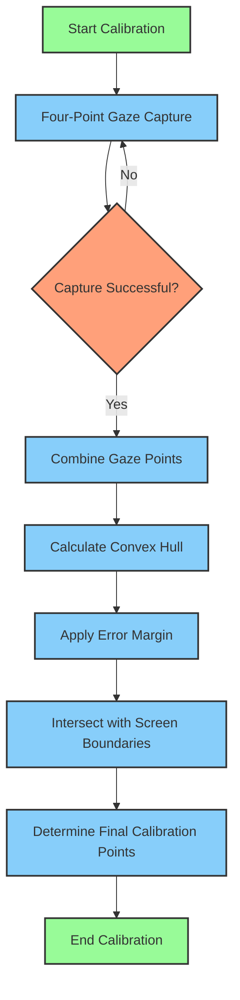

# VisionGuard Features and Usage

## Key Features

- **Real-time Eye Gaze Tracking:** Monitors your screen time with precise gaze tracking. All processing is done locally, ensuring your privacy and data security.
- **Customizable Break Notifications:** Reminds you to take breaks at customizable intervals, following the 20-20-20 rule or other user-defined settings.
- **Daily and Weekly Statistics:** Provides detailed statistics on your screen time, stored locally and automatically cleared after one week.
- **Device Switching:** Easily switch between CPU, GPU, and NPU devices to optimize performance based on your setup.
- **Multiple Capture Devices:** Supports switching between up to five connected camera devices for flexibility in use.
- **Dark and Light Themes:** Offers customization of the interface with dark or light themes according to your preference.
- **Resource Utilization Monitor:** Monitors and displays system resource usage to ensure the application runs efficiently.
- **Optimized for Performance:** Allows switching between different quantized weights to balance performance and resource efficiency.
- **Frame Processing Limitation:** Limits the number of frames processed to optimize resource usage and performance.
- **System Tray Application:** Runs in the system tray, providing quick access to key features without cluttering your desktop.
- **Robust Architecture:** Built with C++ for memory efficiency, using Qt6, OpenCV, and OpenVINO to ensure high performance and extensibility.

## Run-Time Control Keys

During runtime, VisionGuard allows you to control the displayed information using the following keyboard shortcuts:

- **G**: Toggle the display of the gaze vector.
- **B**: Toggle the display of face detector bounding boxes.
- **O**: Toggle the display of head pose information.
- **L**: Toggle the display of facial landmarks.
- **E**: Toggle the display of eye state (open/closed).
- **A**: Display all inference results.
- **N**: Hide all inference results.
- **F**: Flip frames horizontally.
- **Command + Q**: Quit the application.

### Resource Monitor Keys

The resource monitor can be controlled using these keys:

- **C**: Display CPU average usage.
- **D**: Display CPU distribution.
- **M**: Display memory usage.

## Usage Instructions

1. **Launching VisionGuard:**
   - After installation, launch VisionGuard from the Start menu or desktop shortcut.
   - Ensure your webcam is connected before starting the application.

2. **VisionGuard Calibration Process Documentation**

The VisionGuard calibration process is designed to accurately map the user's gaze to screen coordinates. This process involves a four-point calibration technique combined with error margin adjustment for improved accuracy and usability.

### Calibration Overview

The calibration process consists of the following main steps:

1. Four-point gaze capture
2. Convex hull calculation
3. Error margin application
4. Final calibration point determination

### Detailed Process

#### Four-Point Gaze Capture

[Figure 1: Four-Point Calibration Screen]

Description: A full-screen black background with four green dots in the corners. Text instructions in the center guide the user.

Process:

1. The user is presented with a full-screen black background.
2. Four green dots appear sequentially in the corners of the screen.
3. For each dot, the user is instructed to look at it for 1.2 seconds.
4. Multiple gaze points are captured for each corner during this period.

#### Convex Hull Calculation

Description: A scatter plot of all captured gaze points with a polygon (convex hull) enclosing the outermost points.

Process:

1. All captured gaze points from the four corners are combined.
2. A convex hull algorithm is applied to find the smallest convex polygon that encloses all these points.

#### Error Margin Application

Description: The convex hull from Figure 2 with an extended boundary around it, representing the error margin.

Process:

1. The convex hull is extended outward by the specified error margin (default 150 pixels).
2. This extension creates a larger area to account for potential inaccuracies in gaze tracking.

#### Final Calibration Point Determination

Description: The screen with four points marked, representing the final calibration points after applying the error margin and screen boundary constraints.

Process:

1. The extended convex hull is intersected with the screen boundaries.
2. The four corners of this intersection become the final calibration points.
3. These points define the area within which gaze tracking will be considered "on-screen".

### User Interface Controls

#### Error Margin Adjustment

[Figure 5: Error Margin Control UI]

Description: A spinbox labeled "Error Margin" and a "Set Margin" button.

Functionality:

- Users can input a custom error margin value in pixels.
- The "Set Margin" button triggers recalibration with the new margin.

#### Calibration Reset

[Figure 6: Reset Calibration UI]

Description: A "Reset Calibration" button.

Functionality:

- Resets the calibration to default settings.
- Sets the error margin back to the default value (150 pixels).
- Recomputes calibration points based on default screen corners.

### Calibration Process Flow

Description: A flowchart illustrating the steps from initiating calibration to final calibration point determination.

Steps:

1. Start Calibration
2. Four-Point Gaze Capture
3. Combine Gaze Points
4. Calculate Convex Hull
5. Apply Error Margin
6. Intersect with Screen Boundaries
7. Determine Final Calibration Points
8. End Calibration

### Best Practices for Accurate Calibration

1. Ensure consistent lighting conditions.
2. Maintain a stable head position during calibration.
3. Focus on each calibration point for the full duration.
4. Adjust the error margin based on individual user needs and environmental factors.
5. Recalibrate if there are significant changes in user position or lighting conditions.

### Troubleshooting

Common issues and their solutions:

1. Inaccurate tracking: Try increasing the error margin or recalibrating.
2. Calibration fails: Ensure proper lighting and camera positioning.
3. Gaze always detected as off-screen: The error margin might be too small, try increasing it.

3. **Customizing Settings:**
   - Navigate to the settings menu to customize break intervals, theme preferences, and device configurations.

4. **Viewing Statistics:**
   - Access daily and weekly screen time statistics from the main interface. These are automatically cleared after one week.

4. **System Tray Access:**
   - VisionGuard runs in the system tray. Right-click the tray icon to access key features quickly without opening the full application.
