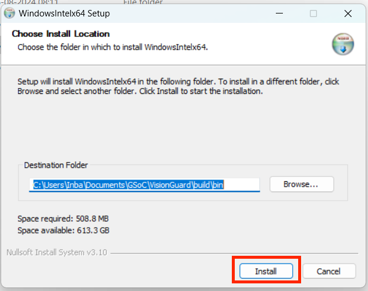
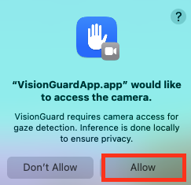
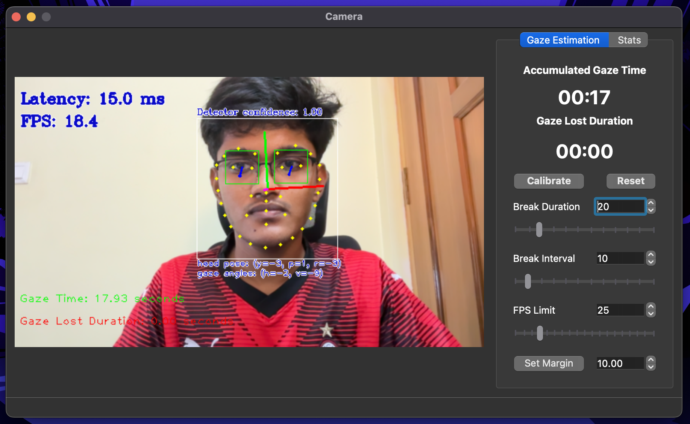
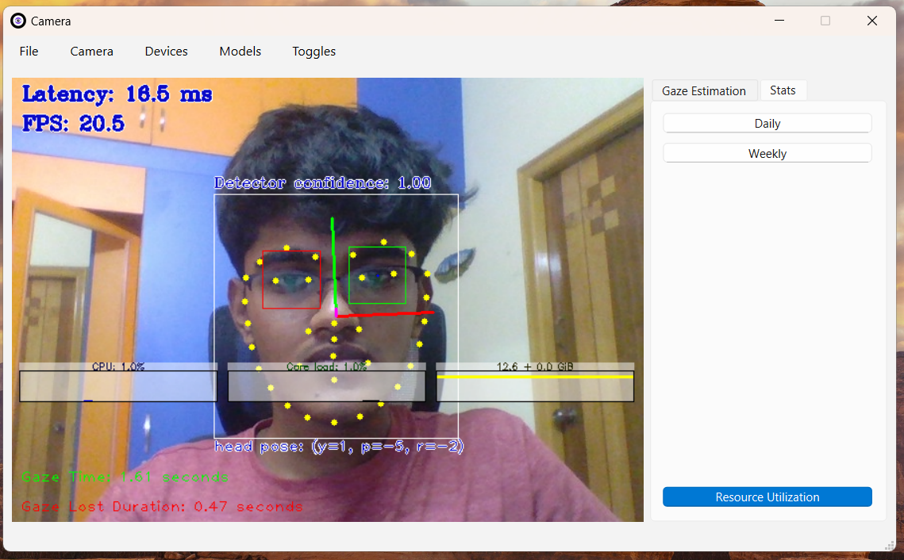
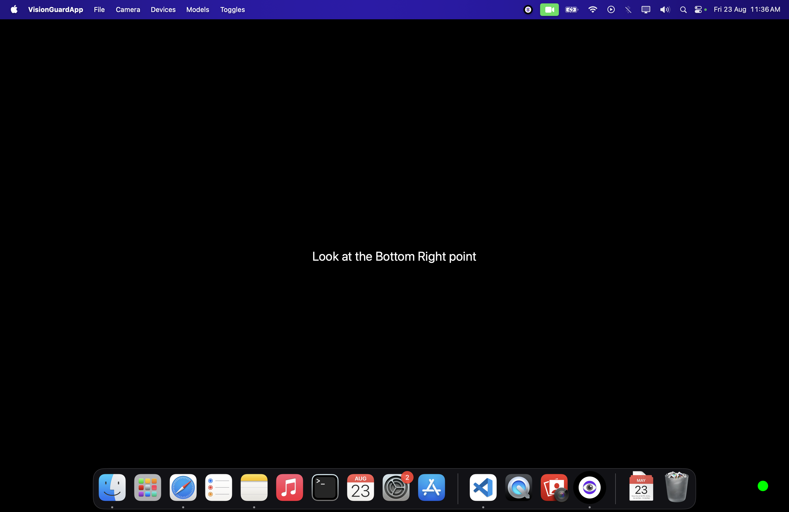
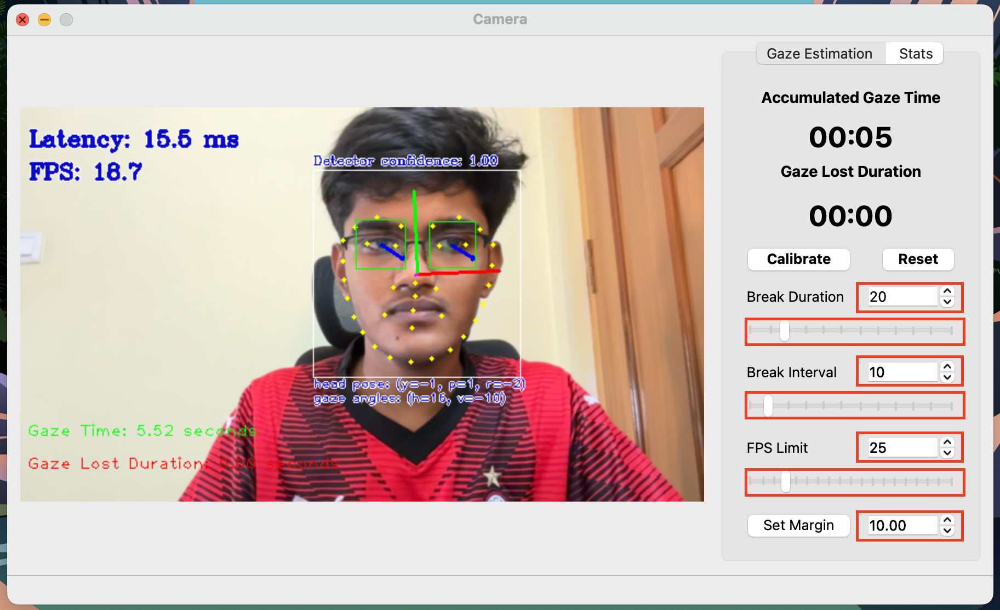
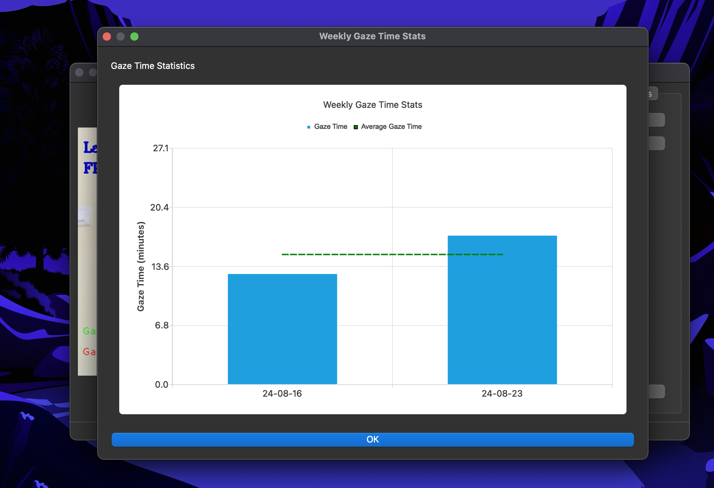
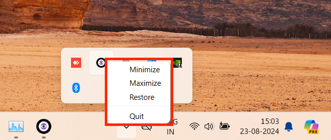

# VisionGuard: User Guide and Calibration Process

## Table of Contents

1. [Introduction](#introduction)
2. [Installation and Launch](#installation-and-launch)
3. [Main Interface](#main-interface)
4. [Run-Time Control Keys](#run-time-control-keys)
5. [Calibration Process](#calibration-process)
6. [Customizing Settings](#customizing-settings)
7. [Viewing Statistics](#viewing-statistics)
8. [System Tray Features](#system-tray-features)
9. [Best Practices](#best-practices)
10. [Troubleshooting](#troubleshooting)

## 1. Introduction

VisionGuard is an advanced screen time management tool that uses your webcam to monitor your gaze and encourage healthy viewing habits. This guide will help you set up, calibrate, and effectively use VisionGuard.

## 2. Installation and Launch

### Installation

1. Download the VisionGuard installer from the official website.
2. Run the installer and follow the on-screen instructions.
3. Restart your computer after installation.

### Launching VisionGuard

- Launch VisionGuard from the Start menu or desktop shortcut.
- Ensure your webcam is connected and functioning before starting the application.

Description: A screenshot showing the VisionGuard launch screen with a "Allow" button to access the web-camb.

## 3. Main Interface

**Main Window Application Features**:

- Real-time Gaze Vector Display
- Gaze Calibration Window
- Switch between up to 5 camera devices
- Switch between FP32, FP16, and FP16-INT8 models
- Switch inference devices
- Ongoing Screen Time Widget
- Notification Alert Message Box
- Custom Settings (break duration, break frequency, FPS limit, calibration error margin)

## 4. Run-Time Control Keys

During runtime, VisionGuard allows you to control the displayed information using the following keyboard shortcuts:

### Display Control Keys

- **G**: Toggle the display of the gaze vector.
- **B**: Toggle the display of face detector bounding boxes.
- **O**: Toggle the display of head pose information.
- **L**: Toggle the display of facial landmarks.
- **E**: Toggle the display of eye state (open/closed).
- **A**: Display all inference results.
- **N**: Hide all inference results.
- **F**: Flip frames horizontally.
- **Command + Q (Mac)** or **Alt + Q (Windows/Linux)**: Quit the application.

### Resource Monitor Keys

The resource monitor can be controlled using these keys:

- **C**: Display CPU average usage.
- **D**: Display CPU distribution.
- **M**: Display memory usage.

## 5. Calibration Process

The calibration process ensures accurate gaze tracking by mapping your eye movements to screen coordinates.

### Calibration Overview

1. Four-point gaze capture
2. Convex hull calculation
3. Error margin application
4. Final calibration point determination

### Detailed Calibration Steps

For detailed calibration steps, please refer to the system architecture documentation.

### Calibration UI Controls

1. "Start Calibration" button
2. Error Margin input field with "Set Margin" button
3. "Reset Calibration" button

## 6. Customizing Settings

The Gaze Estimation settings menu showing options for

1. Break duration
1. Break intervals
2. FPS limit
3. error margin for claibration

contains sliders and spin wheels

## 7. Viewing Statistics

1. Daily and weekly screen time graphs
2. Break adherence rate
3. Peak usage times

To view your statistics:

1. Click the "Statistics" button on the main interface.
2. Navigate through different time frames using the provided controls.
3. Statistics are automatically cleared after one week for privacy.

## 8. System Tray Features

VisionGuard runs in the system tray for quick access to key features.

1. Pause/Resume tracking
2. Take a break now
3. Open main window
4. View quick statistics
5. Exit application

## 9. Best Practices

1. Ensure consistent lighting conditions during use.
2. Maintain a stable head position, especially during calibration.
3. Focus on each calibration point for the full duration.
4. Adjust the error margin based on your needs and environment.
5. Recalibrate if you change your sitting position or lighting conditions significantly.

## 10. Troubleshooting

Common issues and solutions:

1. Application not starting:
   - Check for conflicts with antivirus software
   - Ensure you have the latest version of the [Microsoft Visual C++ Redistributable](https://learn.microsoft.com/en-us/cpp/windows/latest-supported-vc-redist?view=msvc-170#latest-microsoft-visual-c-redistributable-version) appropriate for your system architecture from the official Microsoft website.
   - Update your drivers for the inference engine
   - Verify you have the latest version of VisionGuard installed

2. Inaccurate tracking:
   - Try increasing the error margin
   - Recalibrate the system
   - Ensure proper lighting and camera positioning

3. Gaze always detected as off-screen:
   - The error margin might be too small, try increasing it
   - Check if the calibration points are within your screen boundaries

4. Calibration fails:
   - Ensure proper lighting and camera positioning
   - Check if your webcam is functioning correctly in other applications
