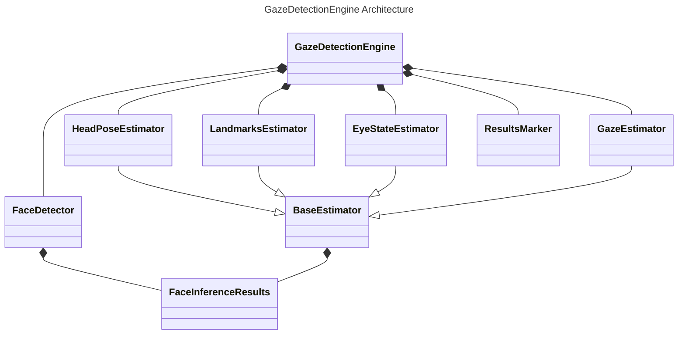

- **GazeDetectionEngine**: The main class that utilizes various components to process the gaze detection.
    - **FaceDetector**: Detects faces in the input image.
    - **GazeEstimator**: Estimates the direction of the gaze.
    - **HeadPoseEstimator**: Estimates the head pose.
    - **LandmarksEstimator**: Detects facial landmarks.
    - **EyeStateEstimator**: Determines the state (open/closed) of the eyes.
    - **ResultsMarker**: Marks the results on the image for visualization.

- **BaseEstimator**: An abstract base class for all estimators.
    - **EyeStateEstimator**, **GazeEstimator**, **HeadPoseEstimator**, **LandmarksEstimator**: Inherit from `BaseEstimator`